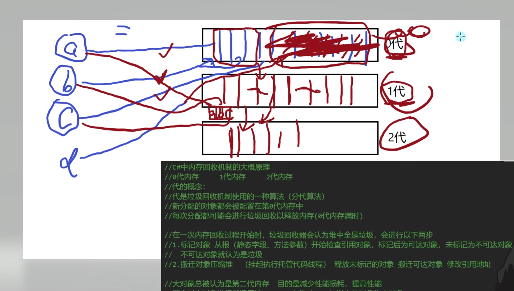
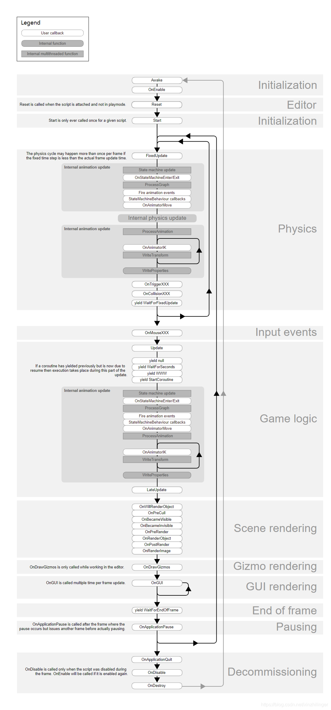
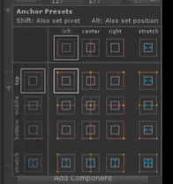
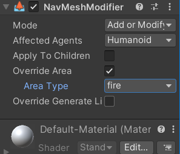

# C#拾遗
## 基本概念
### 字段、属性
1. 字段首字母小写，一般用private修饰
    - 一般用来类内部进行L问
    - 或者配合属性来使用
2. 属性首字母大写，多用public修饰
    - 通常是供外部类L问的
    - 属性本质其实就是一个方法，通过get和set方法来操作对应的字段
    - 属性可以有对应的字段，也可以没有（**C#可以自动在后台为属性创建字段**）
    - 作用：
      - **避免出现非法数据。如可以在属性的set方法中做逻辑判断**
3. 注意
   - **使用属性时，若无对应字段，则属性声明为以下形式**

```C#
    public int SumBulletCount { get; set; }
```
  -  若有对应字段，则必须以下面的形式声明属性,其中get、set视需求至少保留一个。

```C#
        private int curBulletCount;
        public int CurBulletCount { 
            get { return curBulletCount; } 
            set { curBulletCount = value; }
        }
```
   - **错误的声明形式**：
```C#
    private int curBulletCount;
    public int CurBulletCount { get; set; }
```
以该**错误**形式声明后，若在程序中使用字段，curBulletCount值**始终为0**。
    - 另一种错误的声明形式：
```C#
private int curBulletCount;
        public int CurBulletCount { 
            get { return CurBulletCount; } //会不断调用get方法返回属性而非字段，死循环
            set { curBulletCount = value; }
        }
```

4. 区别：
   - 字段能作为ref,out⑹。属性不能
---


### 数据类型

#### 字典Dictionary

存储键值对。**读取数据速度快于数组。**

#### 集合

- 长度可变，存储空间不一定连续（区别于数组）
- 类型：
  - 非泛型集合：
    - **可以存储任意类型的数据**
    - 性能不好，可能发生装箱拆箱；类型不安全，使用不方便，从中读数据时需要手动类型转换
    - 命名空间 System.Collections
  - 泛型集合：
    - **类型固定**
    - 命名空间 System.Collections.Generic

```C#
//列表
        ArrayList arrayList= new ArrayList();
        arrayList.Add(1);
        arrayList.Add(gameObject);//可以放入不同类型的数据

        List<string> list= new List<string>();//限制类型为string
        //list.Add(gameObject);//类型不一致，报错
        list.Add(gameObject.name);

//字典
        //非泛型字典
        Hashtable table1= new Hashtable();
        table1.Add("属性", "damage");
        table1.Add("xiangmu",213);
        table1.Add("cube", gameObject);
        foreach(var item in table1.Keys ) Debug.Log(item + "**" + table1[item]);
        //泛型字典
        Dictionary<string,string> table2= new Dictionary<string,string>();
        table2.Add("xiangmu", "123");
        Debug.Log(table2["xiangmu"]);
        string res;
        table2.TryGetValue("meiyou", out res);
        //字典嵌套
        Dictionary<string,Dictionary<string,string>> table3=new Dictionary<string, Dictionary<string, string>>();
        table3.Add("Tom",new Dictionary<string,string>());
        table3["Tom"].Add("address", "beijing");
        table3["Tom"].Add("phone", "15432323");
        Debug.Log(table3["Tom"]["address"]);

//栈
        stack01= new Stack<string>();
        stack01.Push("mainMenu");
        stack01.Push("itemMenu");
        stack01.Push("gameItemMenu");
        while (stack01.Count > 1)
        {
            Debug.Log(stack01.Pop());//弹栈
        }
        Debug.Log(stack01.Peek());//只取顶值，不弹栈

//队列
        Queue<string> queue = new Queue<string>();
        queue.Enqueue("name");//入队
        queue.Dequeue();//出队
        queue.Peek();//只取首值，不出队
```
- 各种集合：

||非泛型|泛型|特点|使用频率|
|---|---|---|---|---|
|列表|ArrayList|List<T>|有序，通过索引获取值|高|
|字典|Hashtable|Dictionary<TKey,TValue>|无序，通过键Key获取值；键不可重复，s键、值的类型不受限，但实际应用中**键似乎多用字符串的形式**|高|
|栈|Stack|Stack<T>|后进先出||
|队列|Queue|Queue<T>|先进先出|

##### tips
菜单、界面的返回顺序，可以使用栈存储


##### tips 静态工具类

试图制作一个静态工具类时，构造方法应为静态，且类内的公开方法也应为静态。若类内方法为非静态的，则该方法需要在类实例化后再能使用

```C#
        private static Dictionary<string, Texture> cloths;
        static  ResourceManager() { 
            cloths=new Dictionary<string, Texture> ();
        }

        public static Texture LoadCloth(string name) {
            return Resources.Load<Texture>("Texture_Game03/"+name);
        }
```


## 文件系统与IO

须引入命名空间 System.IO

#### DriveInfo驱动器信息类

```csharp
        DriveInfo[] infos=DriveInfo.GetDrives();
        foreach (DriveInfo info in infos)
        {
            Debug.Log(info.Name);
        }
```

#### File与FileInfo

- FIleInfo可以获取文件的Length属性，即一个文件的字节长度
  - 使用时需要先实例化一个FileInfo

```c#
        string filePath = "F:/aa/bb/samplefile.docx";

        //FileInfo
        FileInfo fileInfo = new FileInfo(filePath);
        Debug.Log(fileInfo.FullName);//F:/aa/bb/samplefile.docx
        Debug.Log(fileInfo.Name);//samplefile.docx
        Debug.Log(fileInfo.Length);
        Debug.Log(fileInfo.DirectoryName);//F:/aa/bb
```

- File 使用其静态方法对文件进行创建、移动、复制、删除

```c#
        string filePath = "F:/newfile.txt";
        if(File.Exists(filePath))File.Delete(filePath);
        else File.Create(filePath);
        if (File.Exists(filePath))
        {
            string nfilePath = "F:/aa/bb/file.txt";
            File.Move(filePath, nfilePath);
            //File.Copy(filePath, nfilePath);
        }
```
- File.Create(filePath) **不能跨级创建**，即父文件夹不存在时，无法在其下创建文件，必须先创建文件夹，再创建文件

- File 读写文件
  - 主要用于读写配置文件
    - 配置文件Config放在StreamingAssets文件夹下，**游戏发布时StreamingAssets文件夹不会被打包**，故可以在游戏打包发布后通过修改config来修改游戏中的参数值，如UI描述、文字描述等。 
可以通过Application.StreamingAssetsPath获取该文件夹的路径，在使用Path.Combine()拼接获得配置文件的完整路径
    - 注意：File的Write***()方法写入是覆盖写入；若果要追加写入，可使用Append***()方法，如`File.AppendAllLines()`。
```C#
    private void ReadWriteDemo()
    {
        //读取文本
        string path = "f:/aa/file.txt";
        string text=File.ReadAllText(path);//将文件中全部文本读取为一个字符串
        Debug.Log(text);
        string[]texts=File.ReadAllLines(path);//将文件中全部文本按行读取为一个字符串列表
        foreach(string s in texts)Debug.Log(s);

        //读取字节（如图像、音频等）
        Byte[]bytes=File.ReadAllBytes(path);

        //写文本
        string path02 = "f:/aa/nfile.txt";
        //File.WriteAllText(path02, text);
        File.WriteAllLines(path02, texts);
        //写字节
        File.WriteAllBytes(path02, bytes);
        //追加写入
        File.AppendAllLines(path02, texts);
    }
```

#### Directory与DirectoryInfo

Directory使用静态方法，对文件夹创建、删除、获取子目录等，DirectoryInfo需要先实例化再使用

```c#
        string path = "F:/aa/bb";      
        if(!Directory.Exists(path))
            Directory.CreateDirectory(path);
        //Directory.Delete(path);//该路径为空文件夹时可以删除
        //Directory.Delete(path, true);//递归删除该路径下所有文件夹和文件
        string[]fileNames=Directory.GetFiles(path);//获取路径下的所有文件的完整路径，不能获取子文件夹的文件路径。
        string[] dire=Directory.GetDirectories(path);//获取路径下的所有子文件夹完整路径
        foreach (string file in fileNames) Debug.Log(file);
        foreach(string dir in dire) Debug.Log(dir);
```

注意：
- Directory.Delete(path);
  - **该路径为空文件夹时可以删除**
- Directory.Delete(path, true);
  - **递归删除该路径下所有文件夹和文件**
- Directory.CreateDirectory(path);
  - **可以跨级创建目录**，即要创建路径"F:/aa/bb"，但没有aa文件夹，该命令可直接创建aa文件夹再创建bb文件夹

#### Path 路径类
- 用于处理路径字符串
- 均为静态方法

```c#
        string filePath = "F:/aa/bb/samplefile.docx";
        Debug.Log(Path.GetFullPath(filePath));// F:/aa/bb/samplefile.docx
        Debug.Log(Path.GetDirectoryName(filePath));// F:/aa/bb
        Debug.Log(Path.GetFileName(filePath));// samplefile.docx
        Debug.Log(Path.GetFileNameWithoutExtension(filePath));// samplefile
        Debug.Log(Path.Combine("F:", "bb", "cc", "dd"));// F:bb\cc\dd
```

###### 实例

1. 根据文件完整路径创建文件

```c#
    /// <summary>
    /// 创建文件
    /// </summary>
    /// <param name="filePath">文件的完整目录</param>
    private void CreatFileDemo(string filePath)
    {

        if (!File.Exists(filePath))
        {
            string floderPath = Path.GetDirectoryName(filePath);
            if (!Directory.Exists(floderPath))
            {
                Directory.CreateDirectory(floderPath);
            }
            File.Create(filePath);
        }
        else Debug.Log("**文件 " + filePath + " 已存在");
    }
```

2. 根据文件完整路径移动文件

```C#
    /// <summary>
    /// 移动文件
    /// </summary>
    /// <param name="fromPath">源文件的完整路径</param>
    /// <param name="toPath">目标文件夹路径</param>
    private void MoveFileDemo(string fromPath,string toPath)
    {
        if (!File.Exists(fromPath)) Debug.Log("** "+fromPath + "不存在！");
        else
        {
            if (!Directory.Exists(toPath))
            {
                Directory.CreateDirectory(toPath);
            }
            string fileName=Path.GetFileName(fromPath);
            //拼接路径，获得目标文件完整路径
            string fileNewPath=Path.Combine(toPath,fileName);
            if (!File.Exists(fileNewPath)) File.Move(fromPath, fileNewPath);
            else Debug.Log("** " + fileNewPath + "已存在");
        }
    }
```
*复制文件同上，将File.Move(fromPath, fileNewPath);改为File.Copy(fromPath, fileNewPath);*
*可以制作一个工具类*

#### Stream类
只能读字节

```C#
    private void StreamDemo()
    {
        Stream stream = new FileStream("D:/file.txt",FileMode.Open);
        byte[] buffer = new byte[stream.Length] ;
        stream.Read(buffer, 0, buffer.Length);//将数据从流读到数组中
        stream.Write(buffer, 0, buffer.Length);//将数组中数据读到流中
        stream.Flush();//将流中数据冲到文件中
        stream.Close();
        string text=System.Text.Encoding.UTF8.GetString(buffer);//将字节数组解码为字符串。UTF8为文件的编码格式，可在文件中修改
        Debug.Log(text);
    }
```


---

## 设计模式
### Unity中常用的设计模式
#### 单例模式
经常用来写一些管理类，管理UI界面，音效等

对于单例模式有三个问题，需要遇到具体问题具体分析：

1. 是不是线程安全(多个线程同时调用，可能创建多个实例)
2. 是不是懒汉式加载（实例对象是第一次被调用时才真正创建，在不知道这个对象是否需要被真正调用时的情况下，这种方式比较合理）
   - 饿汉式是指,初始化时就实例出一个对象,并且这个对象伴随进程的生命周期
   - 懒汉式是指,当需要的时候进行一次实例化,进而伴随进程生命周期
3. 能不能通过反射破坏


##### 继承MonoBehaviour类的单例模式
在实现对象池时使用了单例模式，第一种方式是实现了MonoBehaviour类的单例，即该脚本需要挂载在物体上

代码如下：

```csharp
    public class HPBarPool : MonoBehaviour
    {
        private static HPBarPool instance;
        private Queue<EnemyHPBarLogic> barlogicsPool;
        public int initCount;
        public int maxCount;
        public EnemyHPBarLogic hPBarLogicPfb;
       
        void Awake()
        {
            instance = this;
            barlogicsPool = new Queue<EnemyHPBarLogic>();
            for (int i = 0; i < initCount; i++)
            {
                //初始化对象池
            }
        }


        /// <summary>
        /// 从对象池获取一个对象
        /// </summary>
        /// <returns></returns>
        public EnemyHPBarLogic GetObject() {
            //...
            return hPBarLogic;
        }

        /// <summary>
        /// 回收对象到对象池中
        /// </summary>
        /// <param name="hPBarLogic"></param>
        public void ReclaimObject(EnemyHPBarLogic hPBarLogic) {
            //...
        }

        public static HPBarPool GetInstance() {
            
            Debug.Log("instance:" + HPBarPool.instance);
            return instance;
        }
    }
```

在其他脚本中使用该单例：

```csharp
    public class PoolTestLogic : MonoBehaviour
    {
        private HPBarPool pool;
        private void Start()
        {
            pool= HPBarPool.GetInstance();
            Debug.Log("pool:"+pool);
        }
        //...
    }
```

###### 对象池踩坑1
一开始在单例模式的脚本中，将静态成员instance的赋值语句`instance=this;`放在了Start()方法中，即
```csharp
    Start(){
        instance=this;
    }
```
这导致了一个问题，就是在脚本PoolTestLogic中初始化对象池pool时，`HPBarPool.GetInstance();`返回的instance是null，即instance此时尚未被赋值。

原因：Unity中如果不强制设置脚本的执行顺序，则无法控制执行顺序。能确定的只有先执行所有的Awake(),再执行所有的Start()。
这里就是因为PoolTestLogic的脚本的Start()先执行了，此时HPBarPool脚本的Start()还没有执行，即instance尚未被初始化，故通过GetInstance()方法获取的单例instance是null.

解决办法：**把单例脚本中instance的赋值等一系列初始化操作放到Awake()中**，确保其他脚本在Start()中可以获取到单例。

---
最后，还有几句话要嗦一下，虽然和单例模式的关系不大，嘿嘿。
我们需要注意一下Start函数和Awake函数的执行顺序。
在这个例子里，我在LitJsonSample.cs的Awake函数里调用了ReloadFamilyData来初始化数据，细心的童鞋可以发现，在上一篇博文里，初始化数据是在Start函数里完成的。
**之所以要把它挪到Awake函数里，是为了在我们访问单例时，可以保证数据一定已经被初始化了，因此把初始化函数放到Awake函数里，访问单例的代码放在Start函数里。**
同样的原因，在Singleton.cs的脚本里DontDestroyOnLoad (gameObject);需要放在Awake函数，而不是Start函数里。
关于Awake函数和Start函数的执行顺序，可以详见脚本说明。
简单来说，Awake函数在这个脚本在场景中加载时就会调用，至于所有脚本的Awake函数的调用顺序是未知的。然后，在所有的Awake函数调用完毕后，才开始调用Start函数。需要注意的是，Start函数也不是一定立即执行的，它是在该脚本第一次调用Update函数之前调用的，也就是说，如果这个脚本一开始的状态是disable的，那么直到它变成enable状态，在Update函数第一次执行前，才会执行Start函数。两个函数的执行顺序是时间有时正是某些Bug的产生原因！而且这些Bug往往很难发现。

参考链接
- [[Unity3d]单例模式](https://developer.aliyun.com/article/464692#:~:text=1%20%E5%BD%93%E6%88%91%E4%BB%AC%E5%9C%A8%E5%85%B6%E4%BB%96%E4%BB%A3%E7%A0%81%E9%87%8C%E9%9C%80%E8%A6%81%E8%AE%BF%E9%97%AE%E6%9F%90%E4%B8%AA%E5%8D%95%E4%BE%8B%E6%97%B6%EF%BC%8C%E5%8F%AA%E9%9C%80%E8%B0%83%E7%94%A8getInstance%E5%87%BD%E6%95%B0%E5%8D%B3%E5%8F%AF%EF%BC%8C%E5%8F%82%E6%95%B0%E6%98%AF%E9%9C%80%E8%A6%81%E8%AE%BF%E9%97%AE%E7%9A%84%E8%84%9A%E6%9C%AC%E7%9A%84%E5%90%8D%E5%AD%97%E3%80%82%20%E6%88%91%E4%BB%AC%E6%9D%A5%E7%9C%8B%E4%B8%80%E4%B8%8B%E8%BF%99%E4%B8%AA%E5%87%BD%E6%95%B0%E3%80%82%20...%202%20%E5%9C%A8Awake%E5%87%BD%E6%95%B0%E4%B8%AD%EF%BC%8C%E6%9C%89%E4%B8%80%E5%8F%A5%E4%BB%A3%E7%A0%81DontDestroyOnLoad%20%28gameObject%29%3B%EF%BC%8C%E8%BF%99%E6%98%AF%E9%9D%9E%E5%B8%B8%E9%87%8D%E8%A6%81%E7%9A%84%EF%BC%8C%E8%BF%99%E5%8F%A5%E8%AF%9D%E6%84%8F%E5%91%B3%E7%9D%80%EF%BC%8C%E5%BD%93%E6%88%91%E4%BB%AC%E7%9A%84%E5%9C%BA%E6%99%AF%E5%8F%91%E7%94%9F%E5%8F%98%E5%8C%96%E6%97%B6%EF%BC%8C%E5%8D%95%E4%BE%8B%E6%A8%A1%E5%BC%8F%E5%B0%86%E4%B8%8D%E5%8F%97%E4%BB%BB%E4%BD%95%E5%BD%B1%E5%93%8D%E3%80%82,%E9%99%A4%E6%AD%A4%E4%B9%8B%E5%A4%96%EF%BC%8C%E6%88%91%E4%BB%AC%E8%BF%98%E8%A6%81%E6%B3%A8%E6%84%8F%E5%88%B0%EF%BC%8C%E8%BF%99%E5%8F%A5%E8%AF%9D%E4%B9%9F%E5%BF%85%E9%A1%BB%E6%94%BE%E5%88%B0Awake%E5%87%BD%E6%95%B0%EF%BC%8C%E8%80%8C%E4%B8%8D%E8%83%BD%E6%94%BE%E5%88%B0Start%E5%87%BD%E6%95%B0%E4%B8%AD%EF%BC%8C%E8%BF%99%E6%98%AF%E7%94%B1%E4%B8%A4%E4%B8%AA%E5%87%BD%E6%95%B0%E7%9A%84%E6%89%A7%E8%A1%8C%E9%A1%BA%E5%BA%8F%E5%86%B3%E5%AE%9A%E7%9A%84%EF%BC%8C%E5%A6%82%E6%9E%9C%E5%8F%8D%E8%BF%87%E6%9D%A5%EF%BC%8C%E4%BE%BF%E5%8F%AF%E8%83%BD%E4%BC%9A%E9%80%A0%E6%88%90%E8%AE%BF%E9%97%AE%E5%8D%95%E4%BE%8B%E4%B8%8D%E6%88%90%E5%8A%9F%EF%BC%8C%E4%B8%8B%E9%9D%A2%E7%9A%84%E4%BE%8B%E5%AD%90%E9%87%8C%E4%BC%9A%E6%9B%B4%E8%AF%A6%E7%BB%86%E7%9A%84%E4%BB%8B%E7%BB%8D%EF%BC%9B%203%20%E5%9C%A8OnApplicationQuit%E5%87%BD%E6%95%B0%E4%B8%AD%EF%BC%8C%E6%88%91%E4%BB%AC%E5%B0%86%E9%94%80%E6%AF%81%E5%8D%95%E4%BE%8B%E6%A8%A1%E5%BC%8F%E3%80%82%204%20%E6%9C%80%E5%90%8E%E4%B8%80%E7%82%B9%E5%BE%88%E9%87%8D%E8%A6%81%EF%BC%9A%20%E4%B8%80%E5%AE%9A%E4%B8%8D%E8%A6%81%E5%9C%A8OnDestroy%E5%87%BD%E6%95%B0%E4%B8%AD%E7%9B%B4%E6%8E%A5%E8%AE%BF%E9%97%AE%E5%8D%95%E4%BE%8B%E6%A8%A1%E5%BC%8F%EF%BC%81%20%E8%BF%99%E6%A0%B7%E5%BE%88%E6%9C%89%E5%8F%AF%E8%83%BD%E4%BC%9A%E9%80%A0%E6%88%90%E5%8D%95%E4%BE%8B%E6%97%A0%E6%B3%95%E9%94%80%E6%AF%81%E3%80%82%20)

##### 更加通用的对象池ObjectPools
改进了上面的对象池，不在限制类型

```csharp
    public class ObjectPools : MonoBehaviour
    {
        //对象池，该脚本须挂载在Empty GameObject上

        /// <summary>
        /// 存储所有的对象池，string为该对象池对象名，通过string寻找对应对象池
        /// </summary>
        private Dictionary<string, Queue<GameObject>> objectPools;
        public int initCount;
        public int maxCount;
        private static ObjectPools instance;
        [SerializeField]
        private Transform pools;
        private void Awake()
        {
            instance = this;
            pools = transform;
            objectPools=new Dictionary<string, Queue<GameObject>>();
        }

        /// <summary>
        /// 从对象池中获取一个对象，并设为该脚本所在对象的子物体
        /// </summary>
        /// <param name="pfb">基于该预制体获取对象</param>
        /// <returns>获取的对象</returns>
        public GameObject CreatObject(GameObject pfb) {
            return CreatObject(pfb, pools);
        }

        /// <summary>
        /// 从对象池中获取一个对象，并指定父物体
        /// </summary>
        /// <param name="pfb">基于该预制体获取对象</param>
        /// <param name="objectRoot">用于放置对象的父物体</param>
        /// <returns>获取的对象</returns>
        public GameObject CreatObject(GameObject pfb,Transform objectRoot) {
            GameObject res;
            if (objectPools.ContainsKey(pfb.name)) {
                Queue<GameObject> pool = objectPools[pfb.name];
                if (pool.Count > 0) {
                    res = pool.Dequeue();
                    res.SetActive(true);
                }
                else
                {
                    res= Instantiate(pfb,objectRoot.position,Quaternion.identity,objectRoot);
                    res.SetActive(true);
                }
            }
            else
            {
                objectPools.Add(pfb.name, new Queue<GameObject>());
                //Queue<GameObject> pool = objectPools[pfb.name];
                //for (int i = 0; i < initCount; i++) {
                //    GameObject obj = Instantiate(pfb, objectRoot.position, Quaternion.identity,objectRoot);
                //    obj.SetActive(false);
                //    pool.Enqueue(obj);
                //}
                res = Instantiate(pfb, objectRoot.position, Quaternion.identity, objectRoot);
                res.SetActive(true);
            }
            Debug.Log("创建"+ pfb.name);
            return res;
        }

        /// <summary>
        /// 回收对象
        /// </summary>
        /// <param name="obj">要回收的对象</param>
        public void DestroyObject(GameObject obj)
        {
            string name=obj.name;
            if(name.Contains("(Clone)"))
                name = obj.name.Replace("(Clone)","");
            Debug.Log(this.name+"**"+objectPools+"**"+name);
            if (objectPools.ContainsKey(name)) {
                Queue<GameObject> pool = objectPools[name];
                if (pool.Count < maxCount) {
                    pool.Enqueue(obj);
                    obj.SetActive(false);
                }
                else
                {
                    Debug.Log(name + "对象池容量已经达到最大");
                    Destroy(obj);
                }
            }
            else
            {
                objectPools.Add(name, new Queue<GameObject>());
                objectPools[name].Enqueue(obj);
                obj.SetActive(false);
            }
            Debug.Log("收回" + obj.name);
        }

        /// <summary>
        /// 获取对象池实例
        /// </summary>
        /// <returns></returns>
        public static ObjectPools GetInstance()
        {
            return instance;
        }
    }
```

###### 对象池踩坑2
使用上面的ObjectPools对象池创建角色对象，注意在创建对象时使用了SetActive(True),回收对象时使用了SetAvtive(false)

角色对象挂有脚本CharacterInfo,代码如下：

```csharp
     public class CharacterInfo:MonoBehaviour
    {
        /// <summary>
        /// 生命值
        /// </summary>
        public float hp;
        public float maxHp;
        private ObjectPools pools;

        //private void Awake()
        //{
        //    hp = maxHp；
        //}

        //设计之初设想角色对象死亡后就销毁，生成时就重新创建一个，所以这种情况下把hp的初始化放在Awake或者Start中都是可以的
        //但在使用对象池创建和收回角色对象时，角色死亡时由对象池回收并禁用，创建角色时从对象池中取出角色对象并且激活，若这时仍然把hp初始化放在Awake中，hp初始化语句只会在场景建立时执行一次，再次从对象池中取出时不会再执行初始化。
        //OnEable()在对象激活时调用，所以可以把hp初始化语句放在其中
        private void OnEnable()
        {
            hp = maxHp;
        }

        private void Start()
        {
            pools=ObjectPools.GetInstance();
        }
    }
```

运行后生成对象正常，对象hp降为0后死亡，对象池回收对象。
假设对象池中只有一个对象，此时再继续创建对象时，会取出上一次回收的对象并激活，而该对象的hp值此时仍为0，与需求不符。

- 解决办法：
  - 方法1：把hp**初始化代码放在OnEnable()方法中**，这样在每次从对象池中取对象时，都会调用一次OnEnable,保证每一次都可以把hp初始化
  - 方法2：为CharacterInfo类**实现Reset()方法**，回收对象时调用该方法初始化成员变量
    - Reset()方法是MonoBehaviour的方法，直接实现即可。
    
[Unity优化篇：对象池的创建与使用。（简单且实用）]()这篇文章中说了

1. 由于对象池是采用将游戏物体的状态设置为true和false来实现目的，所以有些游戏物体挂载的脚本的Start（）函数和Awake（）函数需要根据情况来更改一下。（可以考虑一下OnEnable，OnDisable）
2. 很多类型的对象被重新使用前，在某些情况下，需要被reset。至少，所有的成员变量都要设置成初始值。这可以在池中实现而不需要用户处理。何时和如何重置需要考虑以下两个方面：
重置是立即的（例如，在存储对象时即重置）还是延迟的（例如，在对象被重新使用后重置）。
重置是被池管理（例如，对于被放入池中的对象来说是透明的）还是声明池对象的类。

文中提到的文章：

[[译]Unity3D内存管理――对象池(Object Pool) ](https://www.cnblogs.com/mezero/p/3955130.html)

对应的原文：

[C# Memory Management for Unity Developers (part 1 of 3)](https://www.gamedeveloper.com/programming/c-memory-management-for-unity-developers-part-1-of-3-)

[C# Memory Management for Unity Developers (part 2 of 3)](https://www.gamedeveloper.com/programming/c-memory-management-for-unity-developers-part-2-of-3-)

[C# Memory Management for Unity Developers (part 3 of 3)](https://www.gamedeveloper.com/programming/c-memory-management-for-unity-developers-part-3-of-3-)

前两篇讲解了从C#语言本身优化内存和Unity3D Profiler的使用

---

##### 不继承MonoBehaviour的单例模式

*待补充*


## 对象
### 构造函数和析构函数

```c#
    class Person
    {
        private int id;
        private string name;

        public Person()
        {
            id = 1;
            name = "sb";
        }

        public Person(int id)
        {
            this.id = id;
        }

        //构造函数的特殊写法
        public Person(string name):this(1,name)
        {

        }

        //构造函数可以重载
        public Person(int id, string name)
        {
            this.id = id;
            this.name = name;
        }

        public override string ToString()
        {
            return this.id+"=>"+this.name;
        }


        /*
            析构函数：引用类型的堆内存垃圾回收时调用，C++中常用到
            C#中又自动垃圾回收机制GC，所以很少被使用，除非想要在一个对象被垃圾回收时做一些特殊处理
            Unity中几乎不适用析构函数
         */
        ~Person()
        {
            //析构函数
        }


        public static void Main()
        {
            /*
                可以使用无参构造函数的情况：
                1.类中除了默认隐藏的无参构造函数外，没有其他构造函数
                2.类中有其他的有参数构造函数，并且显式地写出了无参构造函数
             */
            Person p1 = new Person();
            Person p2 = new Person(2);
            Person p3 = new Person("Tom");
            Person p4 = new Person(4,"marry");

            Console.WriteLine(p1);
            Console.WriteLine(p2);
            Console.WriteLine(p3);
            Console.WriteLine(p4);
            Console.ReadLine();
        }
    }
```
### 垃圾回收

垃圾回收 GC (Garbage Collector)

GC时，会遍历堆（Heap）上动态分配的所有对象，看它们是否被引用，未被引用的就是垃圾。


GC只负责堆中的垃圾回收，引用类型存在堆中。

值类型在栈中分配内存，由系统自动管理内存回收。

注意：GC会消耗性能，但可以节省内存。如果不GC，会消耗内存，但可以节省一定的性能。

#### GC原理

### 使用属性的意义
#### 通过属性获取数据时可以进行一些逻辑处理

```c#
    private int age;
    public int Age {
            get { return age; }
            set { 
                if(age < 0 ) age = 0;
                age = value;
            } 
        }
```

#### 成员属性比成员变量（字段）有更丰富的权限控制能力

对于字段来说，其权限仅有三种（3P）：
- public 公开的，可以被任何对象获取和修改
- protect 保护的，只能被自身和自身的子类获取、修改
- private 私密的，只能被自身获取、修改

注意，3P权限的获取、修改行为是无法单独控制的，即如果字段能被获取，那么它也能被修改，无法实现**只读**、**只写**的权限控制。

使用属性（成员属性）不仅可以实现3P权限控制，还能实现只读、只写控制。如下：

```c#
        private int id;
        private string name;
        private int age;
        private int hash;

        //设置只读 法一
        public int Id {
            get { return id; } 
        }
        //设置只读 法二
        public string Name { 
            get { return name; } 
            private set { name = value; }
        }
        //可读可写
        public int Age {
            get { return age; }
            set { 
                if(age < 0 ) age = 0;
                age = value;
            } 
        }
        public int Hash { 
            get { return hash; } 
        }
```


## 抽象类
*待补充*
## 接口
定义功能

*待补充*

[C#中抽象类和接口的区别与使用](https://www.cnblogs.com/sunzhenyong/p/3814910.html)

# unity笔记
记录学习过程

---

## 渲染管线

## Lua

## 热更新

## 生命周期

## 旋转
1. 直接修改transform.eularAngle字段。注意，这种方法修改时，检查器中显示的值为负值时，其真实值为360-显示值。
2. 使用transform.Rotate方法。

### 案例1
- 目标鼠标控制镜头旋转，思路如下：
  - 使用Input.GetAxis()获取鼠标动作方向
  - 将返回值乘以转动速度，得出转动角度vertical,horizontal
  - 使用Rotate(vertical,horizontal,0)实现转动
    - 或使用eularAngle.x=EularAngle.x+vertical  
    ...  
    实现
###### tips
使用Rotate()时，须考虑转动的坐标轴是世界坐标轴还是自身坐标轴。单纯写Rotate(...,...,...)指使用自身坐标轴，在上下旋转时Y轴跟随转动，与需求不符。
- 解决：将水平转动与垂直转动分开，即
    - Rotate(vertical,0,0);//垂直
    - Rotate(0,horizontal,0,Space.Word)//水平
- 效果：水平转动绕世界坐标系Y轴，垂直转动绕自身坐标系X轴
###### tips
移动代码一般放在FixedUpdate中运行；旋转建议放在Update中，更流畅。

### 移动

###### tips
**transform.forward返回的向量是在世界坐标系下的向量，并不是（0，0，1）**；把transform.forward转换到自身坐标系下就是（0，0，1）。
Vector3.forwadr就是（0，0，1）这一个向量，不论是在哪个坐标系下都是这个向量。现在有需求：控制物体转向和朝面向方向移动，代码如下：
```csharp
    //转向
    private void Rotate(float horizontal, float vertical)
    {
        if (vertical != 0 || horizontal != 0) {
            transform.forward = new Vector3(horizontal, 0, vertical);
        }           
    }
    //朝着面向方向移动
    private void Move(float horizontal, float vertical)
    {
        if (vertical != 0 || horizontal != 0) {            
            transform.Translate(Vector3.forward * Time.deltaTime,Space.Self);
        }
    }
```
注意，**`transform.Translate(Vector3.forward * Time.deltaTime,Space.Self);`和`transform.Translate(transform.forward * Time.deltaTime,Space.World);`效果是一样的**。解释如下：
- `transform.Translate(Vector3.forward * Time.deltaTime,Space.Self);`
    - 向着自身坐标系中的（0，0，1）方向移动，即面向的方向
- `transform.Translate(transform.forward * Time.deltaTime,Space.World);`
    - transform.forward返回的是在世界坐标系下的向量，所以要在世界坐标系下移动
(Unity3D之如何让对象沿着自身坐标系移动)[https://blog.csdn.net/qq_40664170/article/details/81750350]


---
## 3D数学

### 向量

**向量既可以表示点，也可以表示方向，在使用时一定要想清楚**
- 向量模长 magnitude,计算模长需要开平方；故一般不开平方，使用模长平方SqrMagnitude，效率高。
```C#
    float r1 = pos.magnitude;
    float r2 = pos.sqrMagnitude;
```
- 向量归一化单位化，使用normalized或Normalize()方法,使向量转化为方向不变的单位向量。  
```C#
    Vector3 r3=pos.normalized;
    pos.Normalize();//自身归一化
```
```C#
    t3.Translate(r.normalized*Time.deltaTime);//t3沿向量r的方向移动
    t3.position += r.normalized;//效果同上
```

#### 案例2

将一长度为8的向量v1转换为长度为13的v2，思路：
- 先v1归一化 `v2=v1.normalized;`
- 将归一化向量乘13 `v2=v2*13;`

### 三角函数

|角度Degree | 弧度Radian|
|:---:|:---:|
|180° | PI|
- Unity中的三角函数参数使用的是弧度，故若参数值为角度时需要先转换为弧度
```C#
    Mathf.Sin(rad1);//计算sin
    Mathf.Asin(rad1);//计算arcsin
```

###### tips
- 角度转为弧度
```C#
    float deg1 = 60;
    float rad1 = deg1 * Mathf.PI / 180f;//手动转换
    float rad2 = deg1*Mathf.Deg2Rad;//使用系统提供的Mathf.Deg2Rad=Mathf.PI / 180f
```
-  弧度转为角度
```C#
    float deg = rad * Mathf.Rad2Deg;
```

#### 案例3
- 计算物体右前方30°、10米远处位置世界坐标
```C#
    float len = 10;//斜边长
    float deg = 30;//角度
    float deltaX = len * Mathf.Sin(deg*Mathf.Deg2Rad);
    float deltaZ=len*Mathf.Cos(deg*Mathf.Deg2Rad);
    Vector3 pos= this.transform.TransformPoint(deltaX, 0, deltaZ);
```
###### tips
```C#
    //将自身坐标系中坐标转换到世界坐标系中
    transform.TransformPoint(deltaX, 0, deltaZ);
```
### 向量乘法
v1=[x1,y1,z1],v2=[x2,y2,z2]
- 向量点乘（点积、内积）
    - v1 点乘 v2=x1\*x2+y1\*y2+z1\*z2
    - 几何意义：v1 ・ v2=|v1|・|v2|cos<v1,v2>
    - 作用：已知两向量，求其夹角 
      - 步骤：一般先将量向量归一化，其模均为1，此时点乘值即为cos值
```C#
    Vector3.Dot(v1, v2);//向量点乘
```

###### tips

|余弦曲线|反余弦曲线|
|---|---|
|||  

- 向量叉乘（叉积、外积）

  - 交叉相乘 
  - 几何意义：结果是 两个向量组成面的法向量
  - 方向判断:一般使用右手螺旋定则，在unity中相反，使用左手
  - v3=v1 X v2;|v3|=|v1 X v2|=|v1|・|v2|sin<v1,v2>
  - 应用
    - 创建垂直平面的向量
    - 判断两向量相对位置（根据v3方向）

```C#
    Vector3 v3=Vector3.Cross(v1, v2);
```
###### tips

叉乘、点乘经常结合使用

### 欧拉角

- 使用三个角度保存方向
  
  - X、Z旋转沿自身X、Z轴旋转，Y轴旋转沿世界坐标系旋转 
  - 优点：
    - 只用三个数，占用空间小
    - 方便
    - 三个数字不存在不合法的赋值
  - 缺点：
    - 一个方位的表达方式不唯一 ，如 0，5，0 和0，365，0
    - 万向节死锁：物体沿X轴旋转+-90°时出现，即不能360°无死锁旋转

```C#
    Vector3 v = transform.eulerAngles;
```
### 四元数

Quaternion
- 表示旋转，由一个三维向量x,y,z和一个标量w组成
- x,y,z均沿自身轴旋转
- 
-  四元数乘四元数：表示组合旋转

```C#
     Quaternion qua = Quaternion.Euler(0, 20, 10) * Quaternion.Euler(0, 30, 0);
    //qua=0,50,0
```
- 四元数左乘向量：将该向量按照四元数表示角度旋转
```C#
//将向量v绕y轴旋转30°
    Vector3 v = new Vector3(0, 0, 10);
    Vector3 nv = Quaternion.Euler(0, 30, 0) * v;//
```

- 缺点
  - 存在不合法值
  - 较难使用，不建议单独修改四元数的某个值
###### tips

transform.Rotate()由四元数实现

#### 案例4
- 计算物体右前方30°、10米远处位置世界坐标
```C#
    Vector3 ver = new Vector3(0, 0, 10);
    ver = transform.rotation * ver;// 向量跟随物体旋转
    ver = Quaternion.Euler(0, 30, 0) * ver;//沿y轴转动30度
    ver = transform.position + ver;//从自身坐标系转换到世界坐标系，类似transformPoint
    Debug.DrawLine(transform.position, ver, Color.red);
```
```C#
//另一种写法，即直接使用transform.forward保障向量始终跟随物体旋转
    Vector3 ver = transform.forward * 10 ;// 向量跟随物体旋转
    ver = Quaternion.Euler(0, 30, 0) * ver;//沿y轴转动30度
    ver = transform.position + ver;
    //ver=transform.TransformPoint(ver);
    Debug.DrawLine(transform.position, ver, Color.red);
```

#### 案例5


由于角色与炸弹之间可能有障碍物，即角色与炸弹大致有三种关系：

- 角色完全暴露
- 角色不完全暴露
- 角色不暴露

故不能简单使用角色中心点判断。解决办法：使用炸弹与角色的切点进行判断。
求解切点思路如下：

- 已知条件
    - 炸弹坐标（该脚本挂在炸弹对象上）
    - 玩家坐标、半径

1. 利用反三角函数求解球心与切点连线和球心与炸弹连线的夹角
2. 求出球心与炸弹构成的向量，方向为 球心指向炸弹
3. 该向归一化，乘玩家半径。（玩家半径为其碰撞器半径）
4. 利用夹角及四元数旋转3中向量，得到切点所在方向。
5. 将该点由角色自身坐标系转换到世界坐标系，即得切点位置


```C#
private void Demo08()
    {
        Vector3 boomPos=transform.position;
        GameObject player = GameObject.FindWithTag("Player");
        Vector3 playerPos=player.transform.position;
        float r = player.GetComponent<SphereCollider>().radius;//角色半径
        Vector3 pToB = boomPos - playerPos;
        float dis = pToB.magnitude;
        Vector3 nPToB = pToB.normalized*r;
        float deg= Mathf.Acos(r/dis)*Mathf.Rad2Deg;//反三角函数返回的是弧度，要在Quaternion.Euler中使用需要先转换为角度
        Vector3 p1 = Quaternion.Euler(0, deg, 0) * nPToB;
        Vector3 p2= Quaternion.Euler(0, -deg, 0) * nPToB;
        //向量有方向和长度。求出来的向量表示在某个坐标系下，坐标原点某个方向、某个距离处的点，所以需要进行下面的转换
        Vector3 np1=player.transform.TransformPoint(p1);
        Vector3 np2 = player.transform.TransformPoint(p2);
        if (dis <= 50)
        {
            Debug.DrawLine(this.transform.position, np1, Color.red);
            Debug.DrawLine(this.transform.position, np2, Color.red);
        }
        else {
            Debug.DrawLine(this.transform.position, np1, Color.green);
            Debug.DrawLine(this.transform.position, np2, Color.green);
        }

    }
```

### Vector3静态函数
1. 返回两个向量之间的角度（以度为单位）。

```C#
public static float Angle (Vector3 from, Vector3 to);
```

2. 将向量标准化并使它们彼此正交。即获取与normal正交的向量

```C#
public static void OrthoNormalize (ref Vector3 normal, ref Vector3 tangent);
```
3. 返回向量vector在向量onNormal方向上的投影

```C#
public static Vector3 Project (Vector3 vector, Vector3 onNormal);
```
4. 匀速简单移动，从current到target，步长为step。最终能准确到达目标点。

```C#
current.position = Vector3.MoveTowards(current.position, target.position, step);
```
5.变速移动，不能准确到达目标点，只能无限接近，故当距离小于某一值时可直接修改位置为目标点位置
```C#
current.position = Vector3.Lerp(current.position, target.position, delta);
```
###### tips
Lerp本为插值，即Lerp（0，10，0.1）返回的是1，Update中调用时，应改变的值是delta，但大多代码都去改变current，与插值原意不是很符合。


### Quaternion四元数

#### 常用API：

1. 创建一个从form方向转到to目标方向所需要的旋转
```C#
Quaternion.FromToRotation(Vector3 fromDirection, Vector3 toDirection)
```

设想一个这样的场景，我们用Quaternion.FromToRotation()这个API，把下图主物体(m_MainTran) 的z轴（蓝色轴） 朝向目标物体（m_TargetTran）。


代码如下：
```C#
            //求出目标朝向
            Vector3 targetDir = m_TargetTran.position - m_MainTran.position;
            
            //求出m_MainTran.forward旋转到目标方向需要的旋转四元数
            Quaternion  q = Quaternion.FromToRotation(m_MainTran.forward, targetDir);
            
            //把求出来的旋转四元数应用到 forward 方向
            Vector3 finalDir = q * m_MainTran.forward; 
            
            //最后让主目标的 forward 朝向计算出来的方向
            m_MainTran.forward = finalDir;
```

效果如下：


如果我们想让主目标的x轴朝向目标，即right方向。可以这样写：

```C#
            //求出目标朝向
            Vector3 targetDir = m_TargetTran.position - m_MainTran.position;

            //求出m_MainTran.right旋转到目标方向需要的旋转四元数
            Quaternion q = Quaternion.FromToRotation(m_MainTran.right,targetDir);

            //把求出来的旋转四元数应用到 right 方向
            Vector3 finalDir = q * m_MainTran.right;

            //最后让主目标的 right 朝向计算出来的方向
            m_MainTran.right = finalDir;
```

tips: `这在2D游戏很有用。因为2D游戏我们一般是让物体的x或y朝向目标。`

2. 创建一个旋转。使得目标的正方向(z轴)指向目标forward

```C#
Quaternion.LookRotation(Vector3 forward, Vector3 upwards = Vector3.up)
```
tips: `看向目标时y轴可以在z轴上方，也可以在下方。这里用第2个参数控制，不填的话默认是Vector.up上方。想改变方向可以用Vector.down。`

用Quaternion.LookRotation()来让目标朝向目标方向，上代码:
```C#
            //求出目标方向
            Vector3 targetDir = m_TargetTran.position - m_MainTran.position;
            
            //计算出z轴朝向目标方向需要的旋转四元数
            Quaternion rotation =  Quaternion.LookRotation(targetDir,Vector3.up);
            
            //让m_MainTran.rotation等于求出的旋转
            m_MainTran.rotation = rotation;
```

tips: `这个方法求出来的旋转表示Z轴朝向目标方向需要的旋转。`

#### 旋转插值与动画实现

1. 插值
```C#
Quaternion.Lerp(Quaternion a, Quaternion b, float t)
```

tips: `参数是四元数，我们可以用上面的Quaternion.FromToRotation()或Quaternion.LookRotation()来求出我们要的参数。`


2. 将旋转从 from 转向 to。 旋转的角度为 maxDegreesDelta ，但最后的旋转不会超过to. 所以这里是理论最大旋转角度。源码是用Quaternion.SlerpUnclamped()来计算的。
```C#
Quaternion.RotateTowards(Quaternion from,Quaternion to,float maxDegreesDelta)
```

3. 创建一个旋转。代表以axis方向作为旋转轴，旋转angle角度。
```C#
Quaternion AngleAxis(float angle, Vector3 axis)
```

用这个方法，我们可以让我们的方向沿着任意轴旋转任意角度，精确的按我们想要的效果来旋转。
比如在2D游戏中，我们一般是沿着Vector.forward来旋转；
在3D空间中，我们可以用叉乘来求出旋转轴。

叉乘的数学意义：Vector c = Vector3.Cross(a,b); 求出来的向量c垂直于向量a与b形成的平面。这个向量c就是我们要的旋转轴。
```C#
    //求出旋转轴
    rotAxis = Vector3.Cross(m_MainTran.forward,m_TargetTran.position - m_MainTran.position);
    //计算出每帧的旋转
    Quaternion rotQ = Quaternion.AngleAxis(perAngel * Time.deltaTime,rotAxis);
    //应用旋转
    m_MainTran.forward = rotQ * m_MainTran.forward;
```

### 坐标系

#### WorldSpace
世界坐标系（全局坐标系），是整个场景的固定坐标系，是不变的。
原点是固定的（0，0，0）

作用：对象的世界坐标表示在整个场景中的坐标，是**绝对**的。

#### LocalSpace
物体坐标系（局部坐标系，自身坐标系），是每个对象独立拥有的坐标系，会随着对象移动、旋转而改变位置、方向。
原点是对象模型的轴心点。

作用：描述对象的**相对**位置关系、方向关系。

#### ScreenSpace

屏幕坐标系，以像素为单位。原点为屏幕左下角，右上角坐标是（Scree.width,Screen.height）。


作用：表示物体在屏幕中的位置。

tips：`屏幕坐标系有z坐标，是为了便于和其他坐标系进行转换。z轴表示物体到摄像机的距离。`


#### ViewportSpace

视口坐标系（摄像机坐标系）：屏幕左下角为（0，0），右上角为（1，1），z表示物体到摄像机距离。

作用：表示物体在摄像机中的位置

### 坐标系转换

#### LocalSpace -> WorldSpace


#### WorldSpace -> LocalSpace


#### WorldSpace <--> ScreenSpace


#### WorldSpace <--> ViewportSpace


##### 案例

1. 限制运动范围在屏幕内，到达边缘后不能越出边缘

```C#
    private void Start()
    {
        miainCamera = Camera.main;// 通过mainCamera标签找到主摄像机对象
    }
    private void Update()
    {
        vertical = Input.GetAxis("Vertical");
        horizontal = Input.GetAxis("Horizontal");
        if (vertical != 0 || horizontal != 0)
        {
            Move(horizontal, vertical);
        }
    }

    private void Move(float horizontal,float vertical)
    {

        dir = ScreenPosLimit(horizontal, vertical);
        transform.Translate(dir*moveSpeed*Time.deltaTime);
    }
    /// <summary>
    /// 限制运动范围在屏幕内
    /// </summary>
    /// <param name="horizontal">虚拟轴水平输入</param>
    /// <param name="vertical">虚拟轴垂直输入</param>
    /// <returns>运动方向</returns>
    private Vector3 ScreenPosLimit(float horizontal,float vertical)
    {
        //也可以使用ScreenSpace坐标实现
        viewportPos = miainCamera.WorldToViewportPoint(transform.position);
        if (viewportPos.x <= 0) { 
            if(horizontal<0)horizontal=0;
        }
        if (viewportPos.x >= 1) { 
            if(horizontal>0)horizontal=0;
        }
        if (viewportPos.y <= 0) { 
            if(vertical<0)vertical=0;
        }
        if (viewportPos.y >= 1) { 
            if(vertical>0)vertical=0;
        }
        return new Vector3(horizontal, 0, vertical);
    }
```
2. 物体运动到屏幕边缘，越出边缘后，左出右进，上出下进，其他方向同理

```C#
    private void Move(float horizontal,float vertical)
    {

        dir = new Vector3(horizontal, 0, vertical);
        transform.Translate(dir*moveSpeed*Time.deltaTime);
        //先移动，再判断位置
        transform.position = ScreenPosRecycle(horizontal, vertical);
    }
    /// <summary>
    /// 到达屏幕边缘后，左出右进，其他方向同理
    /// </summary>
    /// <param name="horizontal">虚拟轴水平输入</param>
    /// <param name="vertical">虚拟轴垂直输入</param>
    /// <returns>越界后的新位置</returns>
    private Vector3 ScreenPosRecycle(float horizontal,float vertical)
    {
        viewportPos=miainCamera.WorldToViewportPoint(transform.position);
        if (viewportPos.x <= 0 && horizontal < 0) 
            viewportPos.x = 1;
        else if (viewportPos.x >= 1 && horizontal > 0)
             viewportPos.x = 0;
        if(viewportPos.y <= 0 && vertical < 0)
            viewportPos.y = 1;
        else if (viewportPos.y >=1 && vertical > 0)
             viewportPos.y = 0;
        return miainCamera.ViewportToWorldPoint(viewportPos);
    }
```

### 物理引擎
 模拟真实世界中物体物理特性的引擎

- 碰撞器Collider**优先**选择 Box Collider。
  - 原因：面数少，性能好。
- Mesh Collider是紧密贴合模型的碰撞器，检测网格中每一个点，**性能最差**，消耗极高
  - 若必须使用MeshCollider，则**必须选中Convex**，以合并凸面，可以降低消耗

#### 刚体Rigidbody

- 质量Mass：单位自己统一，表示带刚体物体的质量
- 阻力Drag：广泛意义的阻力，可以包含各种阻力
- 角阻力AngleDrag：旋转时收到的阻力
- 插值Interpolate：用于缓解刚体（与其他刚体接触）运动时的抖动。
  - None 不使用插值进行缓解
  - Interpolate 内插值缓解抖动
  - extra。。。 外插值缓解抖动
- 碰撞检测Collision Detection：快速移动的刚体碰撞时可能相互穿透。碰撞检测频率越高越影响性能。
  - 离散检测Discrete：适用于普通碰撞
  - Continuous：连续碰撞检测
  - Continuous Dynamic：连续动态检测，高速物体的碰撞检测
  - 这里所说的速度应该是比较慢的，所谓高速只是相对的。
  - **当速度确实快时，如子弹，使用碰撞检测也无法检测到，应该使用其他方法检测。**[射线检测](#射线检测)
- 使用重力Use Gravity：是否受重力影响
- Is Kinematic：选中后当前物体不受物理引擎控制，其碰撞可以被物理引擎检测，但**运动不受碰撞效果的影响**

tips：`什么时候加碰撞器：场景中固定的对象，如房子、墙、树等。`

#### 碰撞器 

**是对象的物理边界**
1. 碰撞的条件：
  - 两者都有碰撞器，碰撞器代表着物理边界
  - **运动的物体**必须有刚体组件

2. 碰撞的三个方法


```C#
    private void OnCollisionEnter(Collision other)
    {
    //other碰撞，可以获取当前碰撞的对方物体的对象等
        Debug.Log(other.collider.name);
    }
```

#### 触发器

- Collider勾选Is Trigger即为触发器
- 触发后没有物理运动效果
- 触发的使用条件
  - 两者都具有碰撞器Collider
  - 其中**至少一个**带有刚体
  - 其中至少一个碰撞器勾选Is Trigger
- 触发器方法


```C#
    private void OnTriggerEnter(Collider other)
    {
        Debug.Log(other.name);
    }
```
  -注意触发器方法的参数为Collider，碰撞器方法的参数为Collision。

###### tips

Collision:
1. 可以获取碰撞的接触点的世界坐标

```C#
    private void OnCollisionEnter(Collision other)
    {
        Debug.Log(other.collider.name);
        //获取接触点集合
        ContactPoint[] cps= other.contacts;
        //第一个接触点
        ContactPoint firstContactPoint = cps[0];
        Vector3 point=firstContactPoint.point;
    }
```

2. 获取接触面的法线
```C#
    Vector3 nor=firstContactPoint.normal;
```

###### tips

**一个物体可以有多个碰撞器、触发器**

###### tips

**GetComponentInChildren**
- 可以从所有子物体、**孙子物体**。。。中找到相应组件。


**GameObject.GetComponentInParent**
- 此方法**向上递归,直到其找到**具有匹配组件的 GameObject 为止。仅匹配active=true的 GameObjects 上的组件。

#### 射线检测

```C#
Physics.Raycast();
```

#### 案例
制作武器模块

###### tips
加载资源（预制体、特效等）的两种方法：
1. 设置public变量，在面板中拖拽
2. 使用Resources.Load加载：
```C#
// 资源必须放在Resources目录下
   GameObject obj=Resources.Load<GameObject>("资源名称");
```


#### 关节
**必须用于带刚体的对象**，添加关节组件时，系统会默认添加刚体（Rigidbody）组件。

类型：

- 铰链（合叶）关节 Hinge Joint
  - 适用于对门的模拟，也可用作模型链及钟摆等物体。
- 固定关节 Fixed Joint
  - 将两个刚体束缚在一起, 相对位置保持不变。可用于连接两个**没有父子关系**的对象使其一起运动
- 弹簧关节 Spring Joint
  - 将两个刚体连接在一起，使其像连接着弹簧那样运动。
- 角色关节 Character Joint
  - 模拟人物骨头关节的连接
- 可配置关节 Confingurable Joint
  - 自由连接。通过各种设置来调节连接方式


##### 铰链Hinge Joint


## 动画
### Animation
使用较少，现在多使用Animator

1. animation使用CrossFade播放短动画时，比如只有10帧的动画片段，可能出现不能按照需求正常播放的情况，如需要播放两次实际只播放一次，这是因为其帧数太少导致的

    - 解决：使用PlayQueue播放，可以按队列播放

### Macanim
#### Animator

- 关于动画状态转换的Has Exit Time：
  - 可以看作状态转换的条件，即勾选时，必须在动画播放完成且满足其它条件后才进行状态转换
  - 当该转换没有其它转换条件时，必须勾选这一项，才能保证当前动画播放完后这个转换可以执行
- 一个状态转换的执行条件可以为多个条件满足其一，如在AnyState到pickup添加两次转换，分别为不同条件，则此时满足一个转换的条件即可实现动画转换
  - 
- 如果要求一次转换需要多个条件同时满足的，可在一个转换下添加多个执行条件

#### 子状态机

#### BlendTree
通过一个数值控制多个动画

#### 子状态机

#### BlendTree混合树
一般用于实现移动动画的混合

[学习笔记: Unity Blend Tree动画混合树的使用入门](https://blog.csdn.net/akuojustdoit/article/details/114332071)
##### BlendType
- 1D
- 2D Simple Directional
- 2D Freeform Directional
- 2D Freeform Cartesian
- Direct

###### 1D
1D混合只有一个参数，比如制作人物从站立到行走到跑的混合动画，就比较适合使用1D混合。
###### 2D
###### Direct

#### 利用AnimatorLayer与AvaterMask实现动作负载
可以实现如，一边走一边攻击的效果，即人物的不同部位播放不同动画。这种只能用于Humanoid Avater。

步骤：

- 新建AvaterMask骨骼遮罩。相同部位的动画覆盖可以使用同一个AvatarMask，做不同部位做动画覆盖时要用不同的avatarMask;
- 将AvatarMask中要覆盖的部位激活，其他部位禁用
- Animator中新建Layer，并对其添加AvatatMask
- 通过修改Layer的Weight权重，即可调整动画覆盖的显示程度。为0时不显示覆盖动画，仅显示原动画；为1时显示覆盖动画不显示原动画。可使用animator.SetLayerWeight()方法在代码中控制

### 动画事件Event
在动画执行到某一帧时触发事件。添加动画事件的方法：
1. 点击某一个动画，进入Edit
1. 点击Event,点击左侧加号添加动画事件。拖拽确定事件帧
1. Function为是按调用的方法名，若对象挂载的脚本中无对应public方法则报错。该事件方法可以传入int、float、object等类型的参数
1. 添加完成后点击apply

#### 状态机-AnyState任意状态
使用场景：角色死亡动画、游戏胜利动画等。既可以在任意状态下切换到的动画

#### AnimatorController的复用
当多个对象的动画状态、切换逻辑相同，仅动画Clip不同时，不需要重复创建AnimatorController在逐个添加动画添加切换，只需要创建Animator Override Controller，继承初始的controller。使用方法：


其中Controller为被继承的控制器，下方为原先的动画clip以及对应的新clip。

##### 关于Animator Override Controller的一些要点
###### Animator Override Controller的使用
1. Animator Override Controller的clip是可以运行时改变的（AnimatorController不能在运行时改变clip）

###### Animator Override Controller的性能优化
初始控制器的状态机越复杂，继承控制器性能越差。
具体可参见文章[Unity中Animator Override的性能问题](https://zhuanlan.zhihu.com/p/371397382)

优化方法：
1. 尽量减少基础状态机（要被继承的AnimatorController）的复杂程度，尽量少的在基础状态机里使用很复杂的动画，可以在里面尽量多的使用空AnimationClip（前面的dummy动画），因为反正它们是要被继承重写的。
还有例如我们基础状态机中有上百个State，然后每次只Override两三个，那你就亏成傻逼了。我们可以拆成多个Controller或者拆成多个State来控制，甚至尝试拆成多个Animator。

2. 尽可能增加AnimationClip中Constant曲线的占比，例如在导入选项中进行动画压缩，如下图：
    

    当动画幅度很小时，也可以削减动画的精度，即减小Error相关的值，这样可以压缩掉更多的本来就很相近的关键帧。
    

    上述这些操作这样可以减少曲线数量，增加Constant曲线的占比，同时还会减少内存的占用。
    参考[Unity动画文件Animation的压缩和优化总结](https://zhuanlan.zhihu.com/p/353402448)
3. 使用Timeline系统。Animator设计上把整个Controller看做是一个整体，在运行时所有的操作，例如任何一次Override，任何一次修改，都是对整体数据集的修改，非常的庞大。Unity在做Timeline的时候避免了这个问题，它是基于每个Clip去修改的，因此Timeline整体的性能消耗会更平缓一些，是更加灵活更加好的选择。

4. 花钱消灾，官方定制方案。利用到了JobSystem多线程等。  

#### Animator常用api
- public static int StringToHash (string name);字符串转换为hash
  - `animator.StringToHash('Base Layer.walk');`
  - 使用Animator的SetBool()等方法时，使用SetBool(int id)的重载效率更高，此处传入的id即为paramater字符串对应的哈希值。
  - 建议吧每个paramater string对应的hash放在一个工具类中？作为静态变量？具体原理可参见[Unity中Animator Override的性能问题](https://zhuanlan.zhihu.com/p/371397382)。
- GetCurrentAnimatorStateInfo (int layerIndex);获取当前动画状态
  - 返回一个 AnimatorStateInfo，可获得当前状态的各种信息
- public bool IsInTransition (int layerIndex);
  - 判断指定层上知否正处于状态转换

参考[Animator API--Unity文档](https://docs.unity.cn/cn/2022.3/ScriptReference/Animator.html)


### 特效
1.  创建“特效片”时，如开枪打到墙壁上的效果，显示的特效片片与墙壁重合，并且与墙面垂直，解决办法如下：


```C#
// 创建“特效片”时，因为体积比较小，所以创建后可能与其他物体表面重合在一起，导致看不到。
            //hit.point+hit.normal*0.1f即使特效的创建位置沿射线接触面法向移动一小段距离，从而从重合的面中移动出来
            //Quaternion.LookRotation(hit.normal)将特效的z轴旋转到与接触面法向同向，以保证特效显示正常
            GameObject boom = Instantiate(boomPFB, hit.point+hit.normal*0.1f, Quaternion.LookRotation(hit.normal), boomRoot);
```


### 使用代码片段

#### 间隔固定时间执行

1. 方法一：使用Involve
2. 方法二：使用Time.time计时，如下：

```C#
    if (Time.time >= shotInitTime) {
        ...
        ...
        shotInitTime=Time.time+shotDeltaTime;
    }
```

###### tips

Update方法也可以被重写，父类中写
```C#
protected virtual void Update(){}
```
子类中写
```C#
protected orverride void Update(){
    base.Update();
    ...
    ...
}
```

---

### GUI
#### GUI发展史
GUI：Graphics User Interfa
1. 第一代GUI：OnGUI，Unity自带，界面简单，功能少
```C#
private void OnGUI()
        {
            GUILayout.Label("生命值--"+playerInfo.Hp.ToString());
            GUILayout.Label(playerInfo.gunType.ToString());
            if(GUILayout.Button("按钮")){
                ・・・
            }
            if(playerInfo.gunType==GunType.singleGun)
            {
                GUILayout.Label("弹夹--"+singleGun.CurBulletCount.ToString()+"/"+singleGun.SumBulletCount.ToString());
            }else if(playerInfo.gunType == GunType.mulityGun)
            {
                GUILayout.Label("弹夹--" + mulityGun.CurBulletCount.ToString() + "/" + mulityGun.SumBulletCount.ToString());
            }
        }
```
2. 第二代GUI：NGUI，是GUI插件
3. 第三代GUI：UGUI，是Unity自带，较新的

#### 基础控件

**UI也是GameObject**

##### Canvas画布

基本：
- 是UI元素的载体，所有UI元素必须在Canvas之下。
- Canvas与屏幕的显示内容内容相同
- UI设计建议在2D视角进行 
- 对UI的尺寸修改：修改它的像素width、height，不要修改缩放scale 
- 同一Canvas下控件覆盖顺序取决于面板中顺序，不同Canvas之间覆盖顺序取决于Canvas的排序序号Sort Order

三种画布模式：
- Screen Space-overlay：屏幕坐标系覆盖模式，为2DUI，UI永远会覆盖3D物体，UI独立渲染
    - 覆盖模式性能优于摄像机模式，且操作组件时方便 
- Screen Space-Camera：屏幕坐标系摄像机模式，2DUI，此时需要添加一个渲染摄像机，画布绘制效果受摄像机参数影响
    - 在界面中需要同时显示3D和2D时使用、3D物体盖住2Dui时
    - 需要显示UI特效时使用，特效是3D物体
    - 渲染摄像机不建议使用主摄像机，因为影响性能。
    可以额外生成一个UICamera，并且设置深度值大于主摄像机，并设置UICamera的ClearFlag设置为“仅深度”，即使UICamera的空白部分透明。
    并设置UICamera的剔除遮罩CullingMask为仅显示UI，主摄像机CullingMask不显示UI
- WorldSpace：3DUI
    - 可以把UI贴到3D物体表面，此时需要缩小画布Scale并放到摄像机视野内

##### Rect Transform:
所有的UI组件都有Rect Transform代替Transform，**RectTransform是Transform的子类**

- Pos X Y Z 、weight、height、left、right等都反映控件轴心点相对于自身锚点的位置
- 轴心点Pivot，是缩放、旋转的中心，（0，0）为左下，（1，1）为右上.大于1或小于0时轴心点在物体之外
- 锚点Anchors:屏幕分辨率改变时，确保UI组件位置不变。是UI组件的位置的基准点
  -  每个UI组件都有四个角及对应四个锚点，组件四个角的位置跟随锚点
  -  屏幕分辨率改变时，组件锚点在屏幕中的相对位置不变，如锚点在原屏幕右上角，则分辨率改变后锚点依然在右上角
  -  **位置自适应**：组件四个锚点不分开，移动时一起移动，此时UI图片、文字可以跟队屏幕分辨率改变而自动调整位置
  -  大小自适应：组件四个锚点位置分开设置，组件大小随屏幕比例变化，如屏幕北京需要做大小自适应
     
锚点设置：在组件面板中可以直接设定其位置，按住Shift或alt可同时设置轴心点或位置



代码获取与修改RectTransform：详细可以参见Unity文档[Unity API：RectTransform](file:///E:/Unity%20download/UnityDocumentation/ScriptReference/RectTransform.html)


```C#
        Debug.Log(rectTransform.position);//和transform.postion效果一样，都是世界坐标
        Debug.Log(rectTransform.rotation);//同transform.rotation
        Debug.Log(rectTransform.anchoredPosition3D);//轴心点相对锚点的位置，即Pos X Y Z
        Debug.Log(rectTransform.anchorMin);//锚点与父物体左下相对位置
        Debug.Log(rectTransform.anchorMax);//锚点与父物体右上相对位置
        Debug.Log(rectTransform.rect.width);//UI的宽度
        Debug.Log(rectTransform.rect.height);//UI的高度
        rectTransform.SetSizeWithCurrentAnchors(RectTransform.Axis.Horizontal,10);//设置UI的宽（水平）
        //不同的锚点布局形式， Tect Transform面板的参数显示的也不一样，可以做一个简单的UI自己试验一下
```


##### Image组件

- 作用：显示图片，图片资源须将TextureType类型改为Sprite，再进行拖拽即可显示。
  - 淡入淡出效果可以通过改变Color的RGBA的A值实现
  - ImageType类型：设置为Fill可显示填充过程。设置该类型，并修改FillAmount可以实现技能cd效果，如下：
- 
- 
- Set Native Size：点击Image组件下的Set Native Size按钮，根据图片原始的尺寸设置图片的宽、高：
或调用Image组件方法```this.GetComponent<Image>().SetNativeSize();```


##### Text文本

- Text的外框代表文本的显示区域，与字号无关，但字号太大、外框太小时无法显示文本
- 字号调整FontSize
- 勾选RichText富文本标记：文本中部分文字加入html标签使之有特殊形式，如加粗、斜体、改颜色等：


##### Button按钮

- Interactable：选中时该按钮可以交互，取消勾选时该按钮不能交互，且其外观可以据此变化。如下“保存成绩”的按钮，再使用一次后暂时不需要再次保存，故将其取消交互，并且其外观与其他可交互时有区别：
  - 
  - 注意：取消交互与禁用Button组件效果有区别，若直接禁用Button组件，则其外形与正常状态无差别
- Transition：有三种类型
    - Color Tint：按钮处于不同状态时改变颜色
    - Sprite Swap：按钮处于不同状态时显示不同图片
    - Animation:按钮处于不同状态时播放动画
- - Navigation导航，一般设置为None
- **几乎所有UI组件都可以配置Interactable选项**
##### Toggle复选框

##### Slider滑块
可以用于制作血条等，此时Interactable选项取消勾选

###### 使用Slider滑块组件制作血条的方法

- Canvas中新建一个Slider组件，命名为hpbar对象，删除其Handle Slide Area；（或者新建空物体并添加slider组件自行组装一个滑动条)
- 设置hpbar的Rect Transform，修改其尺寸到合适大小，不需要修改Scale


- 修改background
  - 修改rect transform
  - 设置背景图片和颜色，这里删除了背景图片，只是用颜色来显示血条。
- 修改Fill Area的rect transform
- 修改Fill
  - 修改rect transform
  - 设置背景图片和颜色

##### Scroller滑动条

##### DropDown下拉菜单


#### Canvas组件的渲染模式与屏幕适配

画布（canvas）是 UI 组件的容器，所有 UI 元素都必须放置在画布中。这就好比是电影幕布，所有的影像都在幕布上呈现。

画布的存在，让我们可以将一些通用的 UI 配置放到画布上来配置，比如：

画布与游戏中其他物体是什么样的关系？（渲染模式）
对于不同分辨率的屏幕，画布如何进行适配？（画布缩放 Canvas Scaler）
对于这些问题，画布及其关联组件都提供了多种配置项来适配不同的需求。

##### 渲染模式
渲染模式定义了画布与场景中其他物体在渲染上的关系。渲染模式关注两个核心问题：


1. 是在屏幕空间渲染还是在全局空间渲染？

    用现实中的场景来举例，屏幕空间就像 google 眼镜中的界面，不管你在现实生活里怎么走动，眼镜界面都会在你眼前呈现；而全局空间，则是商场里的大屏广告，随着你的走动，屏幕位置不变，但是在你眼中呈现的效果不断变化。

2. 是覆盖在其他游戏对象之上，还是根据摄像机视野进行渲染？

    覆盖模式下，我们不需要关心有无摄像机，这个画布总是会在屏幕最顶层出现；摄像机模式下，可以理解为画布固定在了摄像机的某个方位上，摄像机移动时，与摄像机相对位置保持不变。


- 在屏幕空间渲染，且覆盖在其他游戏对象之上，则是 Screen Space - Overlay 模式
- 在屏幕空间渲染，且根据摄像机视野进行渲染，则是 Screen Space - Camera 模式
- 在全局空间渲染，（一定是根据摄像机视野进行渲染的）是 World Space 模式


渲染模式的配置在 Canvas 组件的 Render Mode 选项中：


下面我们来看一些更具体的案例以区分三种渲染模式：

以《塞尔达传说：旷野之息》举例，展示血量、温度、噪音、天气、英杰技能等的 HUD，适合使用「屏幕空间 - 覆盖模式」。


背包界面中，游戏对象在背景前方，又在食物详细信息面板后方，这部分画布则适合使用「屏幕空间 - 摄像机」模式。猜测可能需要两层画布，一层作为背景，在游戏人物后方，一层作为信息面板，在游戏人物前方。


《激战2》中，可以看到鹰的上方有个黑色的屏幕，屏幕上有一些文字。这种场景则适合使用「世界模式」。


##### 画布缩放

当画布在屏幕空间中渲染时，画布尺寸一定能正好适配屏幕尺寸吗？当二者不一致时，该怎么进行缩放？

画布缩放器（Canvas Scaler 组件），提供了三种缩放模式来适配不同的需求：

1. Constant Pixel Size：在此模式下，UI 元素的大小将不受 Canvas 的缩放影响，而是保持固定的像素大小。这种模式适用于需要确保 UI 元素在不同设备上的大小保持一致的情况。
2. Scale With Screen Size：在此模式下，UI 元素的大小将根据 Canvas 的缩放比例进行缩放，以适应不同分辨率的设备。这种模式适用于需要在不同分辨率的设备上呈现一致的 UI 布局和视觉效果的情况。**常用！**
3. Constant Physical Size：在此模式下，UI 元素的大小将根据屏幕的物理大小进行缩放，以确保 UI 元素在不同设备上具有相同的物理大小。这种模式适用于需要确保 UI 元素在不同设备上具有相同的物理大小的情况，例如在使用触摸屏幕的设备上。

- 为什么有 Constant Pixel Size ，还需要 Constant Physical Size ？
    - 因为不同设备上的 1 像素，实际大小是不同的，实际大小是由设备像素比（DPR）和每英寸像素（PPI）共同决定的。

原文链接：[Unity Canvas 组件详解：渲染模式、屏幕适配](https://zhuanlan.zhihu.com/p/643275125)

##### 根据屏幕缩放（Scale With Screen Size）的三种模式

比较常用的是根据屏幕缩放（Scale With Screen Size），它有三种模式：

1. 匹配宽度或高度(Match Width or Height)
以宽度为参考、以高度为参考或介于两者之间的值来缩放画布区域。

2. 扩张(Expand)
水平或垂直扩展画布区域，因此画布的大小永远不会小于参考。

3. 收缩(Shrink)
水平或垂直裁剪画布区域，因此画布的大小永远不会大于参考。

开发过程中常用的方式是**根据屏幕大小适配，再配合锚点**基本能满足常用的UI适配；
如果项目可能是超宽屏幕，可以考虑高度匹配； 如果项目使用环境在一定的分辨率范围内，可以考虑匹配高宽0.5的方式适配会更美观；
如果不适配可以考虑恒定像素模式和恒定物理像素模式。效果对比参见
[原文链接](https://blog.csdn.net/qq_33789001/article/details/117781577)

---
#### UGUI图片性能优化

- 优化原理：使用的Sprite数量越少，DrawCall越少，性能越好。故需要将使用的小Sprite放到一张大Sprite中，使用时Image使用大sprite的一部分。
   - 注意：多个Image组件使用同一个Sprite时，认为使用的Sprite数量为1 。


- 优化方法一：Sprite Pack精灵打包
  - 同类型、格式的Sprite才可以打包成一个


- 优化方法二：使用图集，即由美工打包


---
#### 2048UI制作

1. Game面板添加显示设备的分辨率或比例
2. 添加Canvas，设置canvas scaler的UI scale mode为scale with screen size跟随屏幕尺寸缩放
3. 修改referencce resolution为显示设备分辨率
4. 在canvas中添加panel组件，命名为gamecontroller
   - panel面板：可以放置其他UI组件，可以通过移动panel或禁用启用panel实现UI界面的显示隐藏
5. gamecontroller添加layout组件Grid layout group，实现其子物体UI组件表格布局，在gamecontroller的grid layout group组件中设置属性实现布局
   - pad填充：指panel边缘与最近组件的最小距离
   - cell size：每个单元格尺寸
   - space：单元格间距离 

###### tips
简单UI可以用程序生成，复杂UI使用预制体

#### Event事件

添加事件的四种方法：编辑器中拖拽绑定，AddListener使用代码绑定，通过实现接口绑定
##### 在编辑器中拖拽绑定（较少使用）
- 点击此处+号，拖拽挂载脚本的对象，即可选择点击是要调用的方法
- 可以挂载该场景中任意对象，只要该对象有对应的脚本组件
- 该方法调用的方法可以带有参数，但参数类型有限制
- 优点：方便。缺点：无法得知该方法被哪个组件调用
##### AddListener，使用代码绑定
- 优点：容易得知被哪个组件调用
- 步骤：以为Button组件为例 1.在某个对象的脚本中获取目标对象，获取对象上组件，如Button 2.获取时间方法，如OnClick() 3.添加监听器AddListener
  - 代码如下

```C#
    Button btn=GameObject.Find("Button").GetComponent<Button>();
    btn.onClick.AddListener(MyButtonFunction);
``` 
- 有的组件绑定的方法不能有参数，有的必须有参数，可看其对应的AddListener方法
##### 实现接口 绑定
- 脚本挂载在要发生事件的对象上。该对象必须可以接受射线，即**该对象上某组件有选项Raycast Target**，如Image组件，否则无法接受射线。该选项可以取消勾选。
- 须有EventSystem对象， 该对象挂载EventSystem组件，且挂载有输入模块 **Input Modul，如Standalone Input Modul管理键盘鼠标输入，Touch Input Modul 管理触摸输入
- 代码须引入UnityEngine.EventSystems命名空间，实现该命名空间内接口的方法。
- 使用步骤：1.新建脚本 2.在骄傲本中继承相应类，如IPointerClickHandler 3.实现接口方法 4.将该脚本挂载到某个UI对象上
  - 实例代码一，代码目的：双击组件则debug输出

```C#
using UnityEngine;
using UnityEngine.EventSystems;
public class EventDemo : MonoBehaviour, IPointerClickHandler
{//继承接口IPointerClickHandler，则需要实现接口内的方法void OnPointerClick(PointerEventData eventData);
    public void OnPointerClick(PointerEventData eventData)
    {
        if (eventData.clickCount == 2) Debug.Log("eventData.clickCount==2");
    }
}
```

  - 实例代码二，代码目的：鼠标拖拽组件，且拖拽过程中鼠标指针位置始终在图片上拖拽起始时的点击位置

```C#
public class EventDemo : MonoBehaviour, IDragHandler,IPointerDownHandler
{
    private RectTransform rect;
    private Vector3 delta;
    private void Start()
    {
        rect = (RectTransform)transform;
    }
    public void OnPointerDown(PointerEventData eventData)
    {
        //指针点击时记录点击位置，并计算该位置与图片中心的相对位置delta
        //eventData.position为光标点击的屏幕坐标
        Vector3 tmpPos;
        RectTransformUtility.ScreenPointToWorldPointInRectangle(rect, eventData.position, eventData.pressEventCamera, out tmpPos);
        delta = tmpPos - transform.position;
    }
    public void OnDrag(PointerEventData eventData)
    {
        Vector3 pos;
        //UI屏幕坐标 转换为世界坐标
        RectTransformUtility.ScreenPointToWorldPointInRectangle(rect, eventData.position, eventData.pressEventCamera,out pos);
        //保持图片与指针相对位置不变
        transform.position = pos-delta;
    }
}
```
###### 关于可实现的接口：
   <li><code>public interface IEventSystemHandler(PointerEventData)</code>: 所有事件的祖先接口</li><li><code>public interface IPointerEnterHandler(PointerEventData)</code>: 进入事件, 也就是鼠标进入首次进入对象区域</li><li><code>public interface IPointerExitHandler(PointerEventData)</code>: 离开事件, 也就是鼠标进入首次离开对象区域</li><li><code>public interface IPointerDownHandler(PointerEventData)</code>: 按下事件</li><li><code>public interface IPointerUpHandler(PointerEventData)</code>: 抬起事件</li><li><code>public interface IPointerClickHandler(PointerEventData)</code>: 点击事件, 即短时间按下又抬起</li><li><code>public interface IInitializePotentialDragHandler(PointerEventData)</code>: 找到可拖动对象后, 真正开始拖动之前的事件, 整个拖动过程中只发送一次</li><li><code>public interface IBeginDragHandler(PointerEventData)</code>: 开始拖动事件, 整个拖动过程中只发送一次</li><li><code>public interface IDragHandler(PointerEventData)</code>: 拖动事件</li><li><code>public interface IEndDragHandler(PointerEventData)</code>: 停止拖动事件, 整个拖动过程中只发送一次</li><li><code>public interface IDropHandler(PointerEventData)</code>: 拖动并放开事件, 要求放开的时候鼠标还在所拖动的物体内部, 如果同时要处理点击事件(<code>IPointerClickHandler</code>)则无法触发此事件</li><li><code>public interface IScrollHandler(PointerEventData)</code>: 滚动事件</li><li><code>public interface IUpdateSelectedHandler(BaseEventData)</code>: 更新选中事件, 几乎每帧发送</li><li><code>public interface ISelectHandler(BaseEventData)</code>: 切换选中事件, 每次切换选中时向选中的对象发送</li><li><code>public interface IDeselectHandler(BaseEventData)</code>: 取消选中事件, 每次切换选中时向反选中的对象发送</li><li><code>public interface IMoveHandler(AxisEventData)</code>: 导航移动事件</li><li><code>public interface ISubmitHandler(BaseEventData)</code>: 导航提交事件</li><li><code>public interface ICancelHandler(BaseEventData)</code>: 导航取消事件</li>

##### 自定义框架
暂无

---
### iTween

UI缓动实现：iTween DoTween
文档链接：[iTween文档](http://pixelplacement.com/itween/documentation.php)
常用功能：
- iTween 做UI缓动十分方便、开发效率高，但其性能低
- itween的效果可以通过手动编辑曲线AnimatioCurve实现，这种方式性能好，但开发效率低

### 持久化数据
存储数据，即使数据持久，可以被多次重复读取修改。
- Unity提供**PlayerPrefs**类用于**保存用户的偏好设置**，可以用此实现数据持久化
  - 原理：以键值对形式保存数据在一个本地文件中
  - 只支持三种类型数据：int floa string
    - 虽然只支持这三种类型，但可以用其他容器存储其他类型的数据，然后用PlayerPrefs存储索引或者名字，以此实现多种数据类型的设置
  - PlayerPrefs将数据存储在了电脑的注册表中
  - 注册表的数值是可以修改的。我们找到那个数据，直接双击就可修改，所以使用PlayerPrefs存储关键数据使不合适的。
  - 很显然的它很适合用来存储那些即使丢失了也无所谓的数据。
    - **玩家的偏好设置**，比如音乐音量 是否全屏等设置选项。
    - 一些简单的数据。比如玩家的得分列表。
    - 在制作游戏原型时暂时的数据存储。
  - 总之，PlayerPrefs设计的初衷就不是为了真正的玩家存档而服务的

[PlayerPrefs简介](https://developer.unity.cn/projects/61aa4006edbc2a0020e03141)

实例：
```C#
public class learn03 : MonoBehaviour
{
    private int num;
    private void Start()
    {
        num = 0;
        if (PlayerPrefs.HasKey("score")) num = PlayerPrefs.GetInt("score");
    }

    private void OnGUI()
    {
        if (GUILayout.Button("click and count")) num++;

        if (GUILayout.Button("save count and load scene1"))
        {
            PlayerPrefs.SetInt("score", num);
            SceneManager.LoadScene(1);// 保存后加载新场景，在新场景中仍可以读取该数据
        }
        GUILayout.Label("score: " + num);
    }

}
```

实例：利用PlayerPrefs保存玩家模型的服装贴图，或者当前武器
```C#
//修改服装贴图核心代码。
    public Texture cloth;
    private MeshRenderer clothRender;
    //修改meshrender下材质的贴图即可
    clothRender=GetComponentInChildren<MeshRenderer>();
    clothRender.material.mainTexture = cloth;
```

- 修改当前武器的方法：
    - 通过设置武器对象激活与禁用，或者增删子物体，实现武器切换
    - 修改对象的meshfilter和材质贴图实现武器切换
    - 即 **只需要修改图案时，修改meshrender下材质的贴图即可；需要改变形状时，则需要改变不同对象或者改变对象的meshfilter**


### 场景切换

1. 设置切换的场景 File-Build Setting中添加切换的场景列表
2. 使用代码切换


### 射线检测

#### 鼠标点击屏幕发出射线

使用` ray = mainCam.ScreenPointToRay(Input.mousePosition) `可获取子摄像机向鼠标点击方向发出的射线，其中` Input.mousePosition `为鼠标再屏幕上点击位置
再使用` Physics.Raycast(ray, out raycastHit) `获取射线击中点的具体信息

[详解Unity中的射线与射线检测](https://blog.csdn.net/weixin_43147385/article/details/124179148)

注意：要获取raycastHit的collider则被击中对象必须有collider，要获取raycastHit击中对象的rigidbody同理
```C#
    private Ray ray;
    private RaycastHit raycastHit;
    private Camera mainCam;
    void Start()
    {
        mainCam=Camera.main;
    }

    void Update()
    {
        if (Input.GetMouseButtonDown(0)) {
            ray = mainCam.ScreenPointToRay(Input.mousePosition);
            Physics.Raycast(ray, out taycastHit);
            if (raycastHit.collider != null && raycastHit.collider.gameObject.name == "Cube") {
                //...
            }
        }       
    }
```
如果设置了射线检测的layer mask，当该层前面有其他遮挡对象时，射线会穿过该遮挡对象，只击中被检测的层

###### 重要！！

在这样一种场景下使用射线检测：

**父物体下有一子物体，父物体无collider,子物体有collider。**

```
Debug.Log(hit.collider.name+"***"+hit.transform.name);`hit.collider.name拿到的是射线击中的碰撞器
```
**hit.collider.name 返回射线击中的子物体的名字，而hit.transform.name返回射线击中的子物体的父物体的名字！**


###### tips

一开始用这种方法来实现 屏幕上鼠标点击某一物体则改变物体颜色，即发射射线并检测射线是否击中物体。
之后知道了 onMouseDown方法（属于MonoBehaviour类的静态方法），当鼠标在物体上点击时调用该方法，注意点击的物体必须有collider。


#### 射线的其他方法

- Physics.RaycastAll();返回射线所有命中的hit。即，击中第一个对象后不会停止，会穿透并继续击中后续对象。
- 注意，Physics.Raycast();击中第一个物体后就停止了，即只能返回一个hit

```
    private RaycastHit[] hits;
    hits = Physics.RaycastAll(mainCam.transform.position, mainCam.transform.forward, 5);
    foreach(var hit in hits){
        //...
    }
```

- Physics.OverlapSphere();球形范围内碰撞器

```
            Collider[]colers=Physics.OverlapSphere(mainCam.transform.position, 1, enemyLayer);
            foreach (Collider col in colers)
            {
                //...
            }
```

### 协程 Coroutine

- 协程可以有多个入口和出口，可以用协程实现任何方法。
- 协程适合实现合作是多任务、迭代器、无限列表
- 开始一个协程时，执行从被调用方法的起始处开始，一直执行到yield return 语句，并且该句必须被执行完毕，之后每次协程被调用时，从协程上一次返回的位置（yield return）之后继续执行
- 协程是单线程的
- 如果想让多个脚本访问一个协程，可以把这个协程写成静态的
- 目前再Unity中没有简便方法获取一个对象调用的协程数量或者一个个协程被哪些对象调用


[Unity 协程(Coroutine)原理与用法详解](https://blog.csdn.net/xinzhilinger/article/details/116240688)

#### 怎么理解unity的协程中的yield关键字（AI答案）

在Unity的协程中，`yield`关键字是一个特殊的指令，用于控制协程的执行流程。协程是一种可以暂停和恢复执行的函数，它允许在函数内部执行一段一段地执行，并在需要时暂停和恢复。

`yield`关键字的作用是让协程在执行到`yield`语句时暂停，并将控制权返回给Unity的事件循环。当协程再次被唤醒时，将从`yield`语句之后的代码继续执行。

在协程中使用`yield`语句可以创建一些异步行为或者等待某些条件满足后再继续执行。例如，你可以使用`yield return new WaitForSeconds(time)`来让协程暂停一段时间后再继续执行。

下面是一个简单的示例，展示了`yield`关键字的用法：


```csharp
public IEnumerator MyCoroutine()
{
    Debug.Log("Coroutine started");
    yield return new WaitForSeconds(2);
    Debug.Log("Coroutine resumed");
    yield return new WaitForSeconds(2);
    Debug.Log("Coroutine finished");
}
```
在上面的示例中，`MyCoroutine()`函数定义了一个协程。当协程开始执行时，会输出"Coroutine started"。然后，执行`yield return new WaitForSeconds(2)`，暂停协程的执行2秒钟，并返回控制权给Unity的事件循环。2秒钟后，协程会恢复执行，并输出"Coroutine resumed"。再次执行`yield return new WaitForSeconds(2)`，暂停协程的执行2秒钟，并输出"Coroutine finished"。最后，协程结束。

通过使用`yield`关键字，我们可以在协程中创建复杂的控制流程，以实现异步行为和等待特定条件满足后再继续执行的功能。

#### 协程的执行流程（AI答案）

协程的执行流程可以大致概括为以下几个步骤：

1. 启动协程：在Unity的Update方法或者其他适当的地方调用协程的函数。
2. 执行协程：从协程函数的顶部开始执行，直到遇到`yield`语句。当执行到`yield`语句时，协程会暂停，并将控制权返回给Unity的事件循环。
3. 判断条件：在协程暂停后，会对`yield`语句后面的条件进行判断。如果满足某个条件（比如返回值不为null），则继续执行下一步，否则继续执行第2步。
4. 执行后续代码：如果条件满足，从`yield`语句之后的代码继续执行。
5. 结束协程：如果协程函数中的所有代码都执行完毕，协程结束。

下面是一个具体的示例，以帮助理解协程的执行流程：


```csharp
public IEnumerator MyCoroutine()
{
    Debug.Log("Coroutine started");
    yield return new WaitForSeconds(2);
    Debug.Log("Coroutine resumed");
    yield return new WaitForSeconds(2);
    Debug.Log("Coroutine finished");
}

void Start()
{
    StartCoroutine(MyCoroutine());
}
```
在上面的示例中，当游戏开始时，会调用`StartCoroutine(MyCoroutine())`来启动`MyCoroutine()`协程。在协程的函数体内，首先会输出"Coroutine started"。然后执行`yield return new WaitForSeconds(2)`，暂停协程的执行2秒钟，并将控制权返回给Unity的事件循环。2秒钟后，协程会恢复执行，并输出"Coroutine resumed"。再次执行`yield return new WaitForSeconds(2)`，暂停协程的执行2秒钟，并输出"Coroutine finished"。最后，协程结束。

这就是协程的执行流程。通过使用`yield`语句，我们可以在协程中实现异步行为和等待特定条件满足后再继续执行的功能。

#### 举一个协程嵌套的例子，然后解释它（AI答案）

好的，下面是一个协程嵌套的例子：


```csharp
public IEnumerator OuterCoroutine()
{
    Debug.Log("Outer Coroutine started");
    yield return StartCoroutine(InnerCoroutine());
    Debug.Log("Outer Coroutine resumed");
    // 其他代码
}

public IEnumerator InnerCoroutine()
{
    Debug.Log("Inner Coroutine started");
    yield return new WaitForSeconds(2);
    Debug.Log("Inner Coroutine resumed");
    // 其他代码
}

void Start()
{
    StartCoroutine(OuterCoroutine());
}
```
在这个例子中，`OuterCoroutine()`和`InnerCoroutine()`是两个嵌套的协程。首先，当游戏开始时，调用`StartCoroutine(OuterCoroutine())`来启动`OuterCoroutine()`协程。然后，`OuterCoroutine()`执行并输出"Outer Coroutine started"。接着，它调用了`InnerCoroutine()`函数，并将结果通过`yield return`返回给`OuterCoroutine()`。此时，`OuterCoroutine()`暂停执行，并将控制权返回给Unity的事件循环。

在事件循环中，Unity会检查优先级队列中的协程，并执行优先级最高的协程。在这个例子中，优先级最高的协程是`InnerCoroutine()`。因此，Unity会执行`InnerCoroutine()`，并输出"Inner Coroutine started"。然后，`InnerCoroutine()`执行`yield return new WaitForSeconds(2)`，暂停自己的执行2秒钟，并将控制权返回给Unity的事件循环。

2秒钟后，`InnerCoroutine()`恢复执行，并输出"Inner Coroutine resumed"。然后，`InnerCoroutine()`结束执行。此时，Unity会检查优先级队列中的其他协程。由于`OuterCoroutine()`在`InnerCoroutine()`之前被挂起，它的优先级可能更高，所以Unity可能会执行`OuterCoroutine()`。

如果Unity选择执行`OuterCoroutine()`，它会从`yield return InnerCoroutine()`之后的代码继续执行，并输出"Outer Coroutine resumed"。然后，`OuterCoroutine()`可以继续执行后续的代码。

请注意，这个例子只是一个演示协程嵌套的简单示例。实际的协程嵌套可能会更复杂，并且执行顺序可能因多种因素而有所不同。因此，在编写协程时，需要仔细考虑和管理协程的执行流程。

#### 看起来协程嵌套和栈有一定关系

是的，协程的嵌套执行与栈有着密切的关系。在许多编程语言中，程序的控制流是通过栈来跟踪的。每个函数调用都会创建一个新的栈帧，其中包含了该调用的局部变量和参数等。当函数调用结束时，它的栈帧将被销毁，从而释放内存。

协程的嵌套执行也是通过栈来跟踪的。当一个协程挂起时，它的栈帧会被保存下来，以便在恢复执行时使用。当一个协程嵌套调用另一个协程时，内层协程的栈帧会被推到外层协程的栈上。当内层协程返回时，它的栈帧将被弹出，外层协程将继续执行。

因此，协程的嵌套执行需要管理栈的操作。在某些情况下，可能需要手动管理栈以避免内存泄漏或错误。但是，大多数现代编程语言和运行时环境都提供了自动管理栈的机制，使得编写协程变得更加简单和安全。

#### 如果我在Update方法中使用协程会发生什么

如果在Unity的Update方法中直接使用协程，可能会导致一些问题。Update方法是Unity运行时循环的一部分，每次游戏运行时都会被调用多次。如果在Update方法中创建和启动协程，可能会导致大量的协程被创建和销毁，从而消耗大量的系统资源，并降低游戏的性能。

此外，如果在Update方法中直接使用协程，还需要注意协程的执行顺序和执行时间。由于协程的执行顺序和时间是不确定的，可能会导致协程的执行顺序与预期不符，或者在某些情况下出现意外的行为。

因此，建议将协程的创建和启动放在适当的位置，例如在游戏开始时或者在特定的函数中。这样可以避免在Update方法中频繁创建和销毁协程，提高游戏的性能和稳定性。同时，也可以更好地控制协程的执行顺序和时间，确保协程的行为符合预期。

#### 协程一般在unity中都用来实现哪些功能

协程在Unity中可以用于实现多种功能，主要包括以下几个方面：

1. 延时操作：使用协程可以创建一个延时循环，让程序在一段时间后执行某段代码。这是通过在协程中调用`WaitForSeconds`函数来实现的。
2. 异步操作：协程可以用于实现异步操作，比如在下载图片、读取文件等操作时，可以使用协程来避免阻塞主线程，提高程序的效率。
3. 复杂的游戏逻辑：对于一些复杂的游戏逻辑，比如角色行为、AI决策等，使用协程可以让代码更加清晰和易于维护。
4. 资源加载：在游戏开发中，经常会需要加载资源，如贴图、音频等。使用协程可以避免阻塞主线程，提高程序的响应速度。
5. 网络通信：在Unity中，可以使用协程来处理网络通信，比如接收来自服务器的消息，避免因为网络延迟而导致主线程阻塞。

总的来说，协程可以用于实现各种需要异步执行或需要控制执行顺序的场景，尤其是在需要处理复杂逻辑或网络通信的大型游戏中非常有用。

##### 实例代码
 实现：协程实现UI文本逐字显示

 ```C#
 public class ienumeratorDemo : MonoBehaviour
{
    
    public Text textLable;
    private string showText;
    private string fullText;
    private bool isPrint;
    public float textShowSpeed;
    private void Start()
    {
        showText = "";
        fullText= "谈笑间强撸灰飞烟灭";
        textLable.text = "";
        isPrint = false;
    }
    /// <summary>
    /// 使用协程实现字符串的字符一个一个打印
    /// </summary>
    /// <param name="text"></param>
    /// <returns></returns>
    private IEnumerator ShowTextOneByOne(string text)
    {
        showText = "";
        for(int i = 0; i < text.Length; i++)
        {
            showText+=text[i];
            textLable.text = showText;
            yield return new WaitForSeconds(1f/textShowSpeed);
        }
        isPrint = false;
    }
    private void OnGUI()
    {
        if (GUILayout.Button("PrintText")&&!isPrint) {
            isPrint = true;
            StartCoroutine(ShowTextOneByOne(fullText));
        }
    }
}
 ```
##### 实例代码
实现：对象按照路径循环移动，路径点处有转向动作，使用协程实现

```C#
public class ienumeratorDemo : MonoBehaviour
{
    //路径点的根节点
    public Transform wpsObj;
    //路径点集合
    private List<Vector3> wps;
    private bool isLoop;
    public float moveSpeed;
    public float rotateSpeed;
    private void Start()
    {
        WpsInit();
        isLoop = false;
    }
    
    private void WpsInit()
    {
        wps = new List<Vector3>();
        for(int i=0; i<wpsObj.childCount; i++)
        {
            wps.Add(wpsObj.GetChild(i).transform.position);
        }
    }

    private void OnGUI()
    {
        if (GUILayout.Button("Loop") && !isLoop) {
            StartCoroutine(TravelPoint());
            isLoop = true;
        }
    }

    private IEnumerator TravelPoint()
    {
        for (int i = 0; i < wpsObj.childCount; i++)
        {
            yield return StartCoroutine(CubeRotate(i));
            yield return StartCoroutine(CubeMove(i));
            if (i == wpsObj.childCount - 1) i = -1;
            
        }
    }

    private IEnumerator CubeRotate(int index)
    {
        if (wps[index]!= transform.position)//避免在初始位置时求lookquaternion为0的bug，
                                            //若不加该判断，在初始位置时求Quaternion.LookRotation，会报提示信息Look rotation viewing vector is zero
        {
            Quaternion qua = Quaternion.LookRotation(wps[index] - transform.position, Vector3.up);
            while (transform.rotation != qua)
            {
                transform.rotation = Quaternion.RotateTowards(transform.rotation, qua, rotateSpeed*Time.deltaTime);
                yield return null;
            } 
        }
        
    }

    private IEnumerator CubeMove(int index)
    {
        while (transform.position != wps[index])
        {
            transform.position = Vector3.MoveTowards(transform.position, wps[index], moveSpeed*Time.deltaTime);
            yield return null;
        }
    }   
}
```

##### 关于协程嵌套

可参见上面AI关于协程嵌套的解释。再上方实例代码中，有
```C#
    private IEnumerator TravelPoint()
    {
        for (int i = 0; i < wpsObj.childCount; i++)
        {
            yield return StartCoroutine(CubeRotate(i));
            //...
        }
    }
```

注意，当执行到`yield return StartCoroutine(CubeRotate(i));`时，程序会暂停，等待协程StartCoroutine(CubeRotate(i))全部执行完毕，再执行后面的语句

### 寻路系统

#### 基本用法
- 常见的寻路方法：
    - 路点寻路：需要自行放置路点，使对象沿路点运动
    - 单元格寻路
    - **网格（Mesh ）寻路**

网格寻路的步骤（unity2022.3版本）：

1. 将场景中固定不动的物体勾选static
1. 烘焙寻路网格
1. 给移动的对象添加NavMeshAgent组件，unity通过该组件实现寻路
1. 给该对象添加脚本实现寻路

#### NavMesh参数解释

##### NavMeshAgent参数

不同版本的界面可能不同，但参数解释基本不变
[NavMeshAgent参数_unity文档](https://docs.unity.cn/cn/2022.3/Manual/class-NavMeshAgent.html)

<table>
<colgroup>
<col style="text-align:left;">
<col style="text-align:left;">
</colgroup>

<thead>
<tr>
	<th style="text-align:left;">属性</th>
	<th style="text-align:left;">功能</th>
</tr>
</thead>

<tbody>
<tr>
	<td style="text-align:left;" colspan="2"><em>Agent Size</em></td>
</tr>
<tr>
	<td style="text-align:left;"><strong>Radius</strong></td>
	<td style="text-align:left;">代理的半径，用于计算障碍物与其他代理之间的碰撞。</td>
</tr>
<tr>
	<td style="text-align:left;"><strong>Height</strong></td>
	<td style="text-align:left;">代理通过头顶障碍物时所需的高度间隙。</td>
</tr>
<tr>
	<td style="text-align:left;"><strong>Base offset</strong></td>
	<td style="text-align:left;">碰撞圆柱体相对于变换轴心点的偏移。</td>
</tr>
<tr>
	<td style="text-align:left;" colspan="2"><em>Steering</em></td>
</tr>
<tr>
	<td style="text-align:left;"><strong>Speed</strong></td>
	<td style="text-align:left;">最大移动速度（以世界单位/秒表示）。</td>
</tr>
<tr>
	<td style="text-align:left;"><strong>Angular Speed</strong></td>
	<td style="text-align:left;">最大旋转速度（度/秒）。</td>
</tr>
<tr>
	<td style="text-align:left;"><strong>Acceleration</strong></td>
	<td style="text-align:left;">最大加速度（以世界单位/平方秒表示）。</td>
</tr>
<tr>
	<td style="text-align:left;"><strong>Stopping distance</strong></td>
	<td style="text-align:left;">当靠近目标位置的距离达到此值时，代理将停止。</td>
</tr>
<tr>
	<td style="text-align:left;"><strong>Auto Braking</strong></td>
	<td style="text-align:left;">启用此属性后，代理在到达目标时将减速。对于巡逻等行为（这种情况下，代理应在多个点之间平滑移动）应禁用此属性</td>
</tr>
<tr>
	<td style="text-align:left;" colspan="2"><em>Obstacle Avoidance</em></td>
</tr>
<tr>
	<td style="text-align:left;"><strong>Quality</strong></td>
	<td style="text-align:left;">障碍躲避质量。如果拥有大量代理，则可以通过降低障碍躲避质量来节省 CPU 时间。如果将躲避设置为无，则只会解析碰撞，而不会尝试主动躲避其他代理和障碍物。</td>
</tr>
<tr>
	<td style="text-align:left;"><strong>Priority</strong></td>
	<td style="text-align:left;">执行避障时，此代理将忽略优先级较低的代理。该值应在 0C99 范围内，其中较低的数字表示较高的优先级。</td>
</tr>
<tr>
	<td style="text-align:left;" colspan="2"><em>Path Finding</em></td>
</tr>
<tr>
	<td style="text-align:left;"><strong>Auto Traverse OffMesh Link</strong></td>
	<td style="text-align:left;">Set to true to automatically traverse OffMesh links. You should turn this off when you want to use animation or some specific way to traverse OffMesh links.</td>
</tr>
<tr>
	<td style="text-align:left;"><strong>Auto Repath</strong></td>
	<td style="text-align:left;">启用此属性后，代理将在到达部分路径末尾时尝试再次寻路。当没有到达目标的路径时，将生成一条部分路径通向与目标最近的可达位置。</td>
</tr>
<tr>
	<td style="text-align:left;"><strong>Area Mask</strong></td>
	<td style="text-align:left;">Area Mask 描述了代理在寻路时将考虑的<a href="nav-AreasAndCosts.html">区域类型</a>。在准备网格进行导航网格烘焙时，可设置每个网格区域类型。例如，可将楼梯标记为特殊区域类型，并禁止某些角色类型使用楼梯。</td>
</tr>
</tbody>
</table>

###### tips
- 若无NavMesh组件，可先在PackageManager中安装Navigation包
- 新版本的Navgation窗口中无Bake按钮，需要在静态场景的对象上添加NavMeshSurface组件
- 


- **将静态场景的对象设置Layer，并在NavMeshSurface的Object Collect中设置烘焙的对象或Layer**
    - 当Collect Objects设为AllGameObject、IncludeLayer设为Everything时，烘焙会出现下面这种情况，即角色模型也被当作场景对象烘焙了
    - 
    - 正确的做法是，将静态环境layer设为environment，并将Include Layer设为Environment

- 注意：静态场景对象烘焙后，烘焙网格已经有了，与静态物体是否激活无关。这时即使禁用静态场景对象，烘焙网格仍然存在，运行时依然可以导航
- 实例如下：
    - 两场地之间加一“桥梁”并烘焙
    - 
    - 将“桥梁”禁用，运行
    - 

    
#### NavMeshModifier



为被烘焙的静态对象添加该组件后，可以修改该组件的区域类型AreaType，如walkable、jump等。再在Navigation窗口设置区域的cost值，可调整寻路代理agent的寻路行为


之后在agent的AreaMask选项中选择相应的区域，即可实现寻路的调整


注意：NavMeshSurface只需要有一个就可以了，效果如下：


#### 其他寻路功能

- A*寻路
- SamplePath

### 在unity中画线

- Debug.DrawLine();
   - 只能在Scene中显示，可用于调试
   - 若要使其在Game中显示，须激活Game的Gizmos
- 使用LineRender组件在Game中画线


---

## 2DGame

#### 使用TileMap（瓦片地图）搭建地图

- 添加TileMap
  - 添加2D对象2D object -> TileMap
  - 不同的TileMap对应有不同的瓦片形状，如六边形、正方形等
- 如何创建Tile瓦片
  - Asset下右键->2D->创建Tile资源
  - 给Tile添加Sprite即可
- Tile常用类型
  - Animation Tile：通过给该瓦片添加多个sprite进行切换，可以实现一个瓦片上的动画效果
  - Rule Tile：有三种模式
    - single：添加一个sprite，同普通瓦片
    - animation：添加多个sprite，同Animation Tile
    - random：添加多个sprite，使用该Tile在TileMap中添加Tile时，随机从中选取Sprite进行显示
- 使用Tile
  - 打开window -> 2D -> Tile Palette瓦片调色板
  - 将Tile拖拽到调色板上
  - 在调色板上选择要使用的瓦片，在TileMap上点击即可添加


ps:markdown的图片路径只支持相对路径，故建议图片保存在md文件的同一文件夹下

###### tips
在Inspector右上角有“锁”，点击可以锁定当前窗口，在点击其他对象时不会切换到其他的窗口


#### 动画
创建AnimationClip之后，除了可以在动画中修改对象的transform，还可以修改其他的属性以实现不同动画效果。如可修改sprite


##### Sprite动画的类型

- 2方向：2D横版，左右方向，可仅使用一个方向的sprite，反方向的通过Sprite的镜像实现，即SpriteRender的Flip
- 4方向：2D俯视，可用动画改变sprite实现
- 8方向：2.5D俯视，一般为3D渲染成2D（3渲2，用工具绘制每一个动作）
- 更多方向。。。


#### 镜头跟随

导入Cinemachine包，使用其虚拟摄像机实现跟随

##### 使用虚拟摄像机后获取鼠标点击位置
问题：在使用Cinemachine之前可以正确获取屏幕坐标转为世界坐标，使用后Camera.main.ScreenToWorldPoint(Input.mousePosition)完全不起效，请问是我什么设置错误了还是Cinemachine要使用其他的方法？
解决：
  - 方法1：相机设置 Projection 为 Orthographic（正交）模式时，Camera.main.ScreenToWorldPoint 转换坐标需要传入目标点到摄像机的z轴方向距离，比如想把屏幕点转换到和角色在同z值的世界点，就需要传入角色z-摄像机z的值，用这个差值替换掉 Input.mousePosition 的z值。
  - 方法2：使用射线检测位置

[使用Cinemachine后屏幕坐标转世界坐标位置不正确不起效](https://developer.unity.cn/ask/question/632fce8aedbc2a001e6b5dcd)


##### 2D角色头顶血条制作

[使用Slider组件制作血条](#使用Slider滑块组件制作血条的方法)
- 使用Slider制作血条、经验条，或Text制作头顶显示的昵称等。
- 以血条hpBar为例如果场景中只有一个角色，那么只需要让血条跟踪角色的位置并显示在角色上方即可，血条脚本代码如下：

```csharp
     /// <summary>
    /// 跟踪的目标
    /// </summary>
    public Transform target;
    /// <summary>
    /// 位置的偏移值
    /// </summary>
    private float offset;
    private Slider hpBar;
    private Camera mainCam;
    private void Start()
    {
        mainCam = GetComponent<Camera>();
        hpBar=GetComponent<Slider>();
    }

    private void Update()
    {
        if (target != null)
        {
            offset = (target.GetComponent<BoxCollider2D>().size.y/2)*target.transform.localScale.y+0.5f;
            
            //如果Canvas的渲染模式是overlay模式，则需要做坐标转换，将世界坐标转换为屏幕坐标
            //transform.position= RectTransformUtility.WorldToScreenPoint(Camera.main,target.position + new Vector3(0, offset,0));
            
            //如果Canvas的渲染模式是Camera模式，则直接使用目标位置进行跟踪即可
            transform.position = target.position+new Vector3(0,offset,0);
            

            hpBar.value = enemyMovementLogic.hp;
            hpBar.maxValue = enemyMovementLogic.maxHp;
        }      
    }
```

如果场景中有多个角色、多个血条时，需要使用脚本来管理分配这些血条。

假设场景如下：有若干个敌人生成点，间隔一定时间生成敌人。

血条管理思路如下：

- 单独创建一个Canvas放置所有生成的血条，使用HpManager脚本负责血条的生成
- 生成敌人时，同时使用HpManager生成一个血条，并将敌人设为血条的追踪屏幕目标
- 敌人死亡时，销毁血条和敌人对象

###### 2D血条管理的狗尾续貂

由于每次生成敌人都要重新创建血条，可能会消耗性能？
所以在初始化时生成一定数量的血条，并设为禁用状态，使用一个队列存储。
当生成敌人时，从队列中取一个血条。
当敌人死亡时，需要把血条的追踪目标设为null，并将该血条放回队列中。

所以说，生成敌人的时候也可以用这种思路，敌人死亡时不去销毁对象，而是放到一个位置。有点像线程池的思想，也许这个叫对象池？

##### 3D角色血条制作
Canvas的渲染模式为World Space,使Slide充当血条，位置在角色上方即可

###### 关于预制体上的脚本

预制体挂载的脚本中，如果写了public的对象，在Inspector面板中是无法给它拖拽上的，因为预制体术语整个项目而非单个场景，而
拖拽的对象属于单个场景，所以unity不允许这样拖拽。如果想要在预制体的脚本中获取对象等，可以通过Gameobject的静态方法进行查找对象

### 布料效果
使用**cloth**组件和**skinned mesh renderer**组件


点击cloth组件的编辑按钮，可以将布料的某个点固定在一个位置，从而实现旗帜飘扬的效果

布料绑定的两种形式：（具体见官方文档）

- max distance：设置布料距离对应绑定点的最大距离，若设为0，则该点的布料不会下垂

- surface penetration 表面嵌入


### 视频播放
使用videoPlater组件


### 天空盒

添加天空盒与相关设置：点击window->rendering->linghting_environment栏

### Unity性能优化之遮挡剔除

- 首先将待优化的对象设为静态occluder static
- window->rendering->occlusion culling 进行设置和烘焙

参考资料[Unity性能优化之遮挡剔除](https://blog.csdn.net/qq_40513792/article/details/115078009)

#### Unity鼠标控制镜头
参考链接[Unity 基础 之 鼠标控制 相机（摄像机Camera）的旋转，移动和 fov 的简单使用整理](https://blog.csdn.net/u014361280/article/details/113689370)

#### Cinemachine实现镜头跟随

可以避免镜头穿墙等，非常实用，建议学习

###### tips
Unity中场景内物体名称命名时不要带有空格，如‘body up’


### Layer与LayerMask（层和层遮罩）
Unity中Layer的存储类似枚举类的存储，即随着索引的增大，Layer的值指数级增加，最大为32层

|Layer 索引|LayeMask对象的value字段值|比特码|
|---|---|---|
|0|0|00000000000000000000000000000000|
|1|2|00000000000000000000000000000001|
|2|4|00000000000000000000000000000010|
|3|6|00000000000000000000000000000100|
|4|16|00000000000000000000000000001000|
|5|32|00000000000000000000000000010000|
|6|64|00000000000000000000000000100000|
|7|128|00000000000000000000000001000000|
|...|...|...|

所以，将LayerMask转换为Layer的方法为，使用log()计算layermask.value的以2为底的对数，即：

```csharp
    /// <summary>
    /// 将layermask转换为layer索引值
    /// </summary>
    /// <param name="layerMask"></param>
    /// <returns></returns>
    private int LayerMask2LayerIndex(LayerMask layerMask) {
        return (int)Mathf.Log(layerMask.value,2);
    }
```

关于LayerMask的两个静态方法

```csharp
// 将Layer的名字转换为Layermask.value值
public static int NameToLayer(string layerName)
// layermask.value转换为layer的名字
public static string LayerToName(int layer);
```
---
#### 踩坑 Unity Hub更新后项目丢失
- 做好项目管理：善用国内的托管服务Gitee或是用GitHub作为仓库。
- 或者作为临时解决方案：项目文件千万不要放在Unity hub目录下。
---

##### Unity中计时、延迟执行功能的实现
###### 方法一 在Update中实现计时

PlayerAttackLogic脚本的连续射击逻辑,代码如下:

```c#
    private void Start(){
        //为了保证按下鼠标立刻设计一次，将timer初始化为shotDeltaTime
        //shotDeltaTime为设计的间隔时间
        timer=shotDeltaTime;
        //如果把timer=0,则按下鼠标键后要等待shotDeltaTime在开始射击，与需求不符
    }

    private void Update()
        {
            if (Input.GetMouseButton(0))
            {
                if (timer >= shotDeltaTime) {
                    Attack();
                    timer = 0;
                }
                else
                {
                    timer+=Time.deltaTime;
                }
                //InvokeRepeating(nameof(Attack), 0, shotDeltaTime);
            }
            else
            {
                timer = shotDeltaTime;
            }
        }
```

一开始的思路是，按下鼠标键后利用InvokeRepeating()反复调用Attack方法，以此实现连续攻击。但要注意的是，如果在Update中直接使用Invoke、InvokeRepeating，则在每一帧都会执行一个Invoke。在Update中直接开启协程同理。
所以改为直接使用一个计时器变量timer进行计时。

如果要在Update中使用Invoke或者协程，需要加一个布尔值作为开关，来保证Invoke或协程只执行一次。

###### 方法二 使用Invoke方法实现计时

*待补充*

**使用Invoke无法传入参数**

###### 方法三 使用协程实现计时

实例：想要在自制的对象池中实现一个延迟回收对象的功能，代码如下

```C#
    public void DestroyObject(GameObject obj,float delay)
        {        
            StartCoroutine(DestroyObject_Delay(obj,delay));
        }
    private IEnumerator DestroyObject_Delay(GameObject obj,float delaytime)
        {
            yield return new WaitForSeconds(delaytime);
            DestroyObject(obj);
        }
```

注意：真正的回收对象的方法`DestroyObject(obj);`放在协程中执行

###### 方法四 DoTween

*待补充*

参考链接[Unity延时执行的n种方法](https://blog.csdn.net/hzhnzmyz/article/details/118422189)

##### 投射阴影和接受阴影投射

有时不想让某一个物体投射阴影，或者不想让物体上接受其它物体的阴影，可以修改Mesh Render中属性来实现。

- Cast Shadows	指定在合适的光源照射在网格上时网格是否以及如何投射阴影。
- Receive Shadows	启用此选项可使网格显示任何投射在网格上的阴影。仅当使用渐进光照贴图时才支持这个选项。

参考[网格渲染器 (Mesh Renderer)](https://docs.unity.cn/cn/2019.4/Manual/class-MeshRenderer.html#lighting)

###### 游戏结束代码
```csharp
    #if UNITY_EDITOR
        UnityEditor.EditorApplication.isPlaying = false;
    #else
        Application.Quit();
    #endif

```